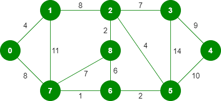

# Minimum Spanning Tree

A spanning tree is a subgraph that is a tree and connects all the vertices. MST is the spanning tree with the minimum weight.

## Steps
It is a greedy algorithm.
1. Sort all of the edges to pick the minimum weight each time.
2. Pick the minimum weight edge if it doesn't create a cycle.
3. Repeat and pick $V - 1$ another edge.

## Code

```python
class Graph:  
  
    def __init__(self, vertices):  
        self.V = vertices  
        self.edges = []  
  
    def add_edge(self, u, v, w):  
        self.edges.append([u, v, w])  
  
    def find(self, parent, v):  
        if parent[v] == v:  
            return v  
        return self.find(parent, parent[v])  
  
    def union_by_rank(self, parent, rank, u, v):  
        u_root = self.find(parent, u)  
        v_root = self.find(parent, v)  
  
        if rank[u_root] < rank[v_root]:  
            parent[u_root] = v_root  
        elif rank[v_root] > rank[u_root]:  
            parent[v_root] = u_root  
        else:  
            parent[u_root] = v_root  
            rank[v_root] += 1  
  
    def kruskal_mst(self):  
  
        result = []  
  
        parent = []  
        rank = []  
  
        # Step 1:  
        # Sort the edges based on their weights        
		self.edges = sorted(self.edges, key=lambda item: item[2])  
  
        for n in range(self.V):  
            parent.append(n)  
            rank.append(0)  
  
        n_of_edges = 0  
        edge_idx = 0  
        while n_of_edges < self.V - 1:  
  
            # Step 2:  
            # Pick the smallest edge and increase the index
			u, v, w = self.edges[edge_idx]  
            edge_idx += 1  
  
            # Calculate the subset  
            u_root = self.find(parent, u)  
            v_root = self.find(parent, v)  
  
            # If they are different pick them  
            if u_root != v_root:  
                result.append([u, v, w])  
                self.union_by_rank(parent, rank, u_root, v_root)  
                n_of_edges += 1  
  
        # Print out the edges  
        print("Edges in MST:")  
        total_cost = 0  
        for edge in result:  
            u, v, w = edge  
            total_cost += w  
            print(f"{u} -- {v}")  
        print(f"Minimum cost is {total_cost}")  
  
```

To find MST for this graph



```python
if __name__ == "__main__":  
    # Create the Graph  
    g = Graph(9)  
    g.add_edge(0, 1, 4)  
    g.add_edge(0, 7, 8)  
    g.add_edge(1, 2, 8)  
    g.add_edge(1, 7, 11)  
    g.add_edge(2, 3, 7)  
    g.add_edge(2, 8, 2)  
    g.add_edge(2, 5, 4)  
    g.add_edge(7, 8, 7)  
    g.add_edge(7, 6, 1)  
    g.add_edge(8, 6, 6)  
    g.add_edge(6, 5, 2)  
    g.add_edge(3, 5, 14)  
    g.add_edge(3, 4, 9)  
    g.add_edge(5, 4, 10)  
  
    # MST  
    g.kruskal_mst()
```

## Applications

Minimum spanning trees have direct applications in the design of networks, including [computer networks](https://en.wikipedia.org/wiki/Computer_network "Computer network"), [telecommunications networks](https://en.wikipedia.org/wiki/Telecommunications_network "Telecommunications network"), [transportation networks](https://en.wikipedia.org/wiki/Transport_network "Transport network"), [water supply networks](https://en.wikipedia.org/wiki/Water_supply_network "Water supply network"), and [electrical grids](https://en.wikipedia.org/wiki/Electrical_grid "Electrical grid")

# References
- [Kruskal’s Minimum Spanning Tree Algorithm | Greedy Algo-2](https://www.geeksforgeeks.org/kruskals-minimum-spanning-tree-algorithm-greedy-algo-2/)
- [Wikipedia - Minimum Spanning Tree Algorithm](https://en.wikipedia.org/wiki/Minimum_spanning_tree)