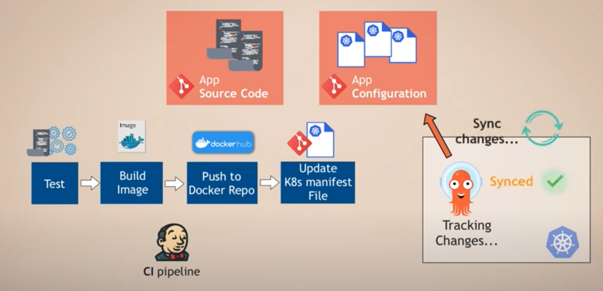

# Argo CD

## Overview

It is a continuous delivery tool, But what is the difference between ArgoCD and other CI/CD tools?

- The CD stage of pipeline needs some plugins and configurations to re-deploy your application on the K8s cluster.
- Beside that there is some security issues because you’re going to give an access to the external service.
- There isn’t also a visibility of deployment status

The Argo CD is going to help us in this point. It is going to be installed as a part of K8s cluster and pulls the application configurations. At any moment that the application configurations are changed, It will try to sync the changes and configured them.

As you can see, instead of triggering the K8s cluster, the Argo CD pulling and checking for changes in contrast.



So as Nana showed, the CI pipeline is going to test, build image, push image and then update the K8s manifest file. Since the Argo CD is constantly watching the app configurations, It will start to sync the changes.

It is a best practice to have separate repositories for application source code and application configurations.

In this case we can split up the CI and CD to have separation of concern. The application source code repository and CI are mostly for developers, and the application configurations repository and CD pipeline is for operations or DevOps. 

## Benefits

- First of all, you don’t need to use `kubectl` or `helm` commands a lot. By pushing the configurations to the git, It will be triggered itself.
- Guarantees the K8s manifests remains the single source of truth
- Using git also gives us much benefits. (such as easy collaboration, rollback, and...)
- Cluster Disaster Recovery
- No additional cluster access to users or services

## Installation

```bash
kubectl create namespace argocd
kubectl apply -n argocd https://raw.github.com/..../install.yml 
```

# References

[ArgoCD Tutorial for Beginners | GitOps CD for Kubernetes](https://www.youtube.com/watch?v=MeU5_k9ssrs&t=15s)