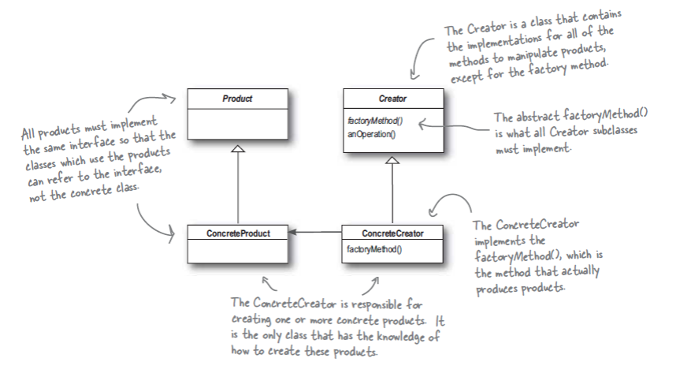
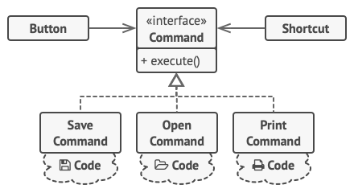
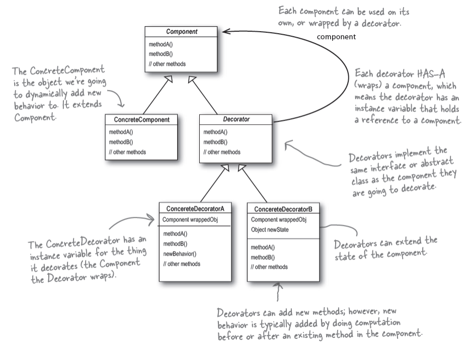

# Design Patterns

There are some common design principles that are common and useful between the developers.

# Creational

## Singleton

## Builder

## Prototype

## Factory

# Behavioral

## Chain of Responsibility

## Command

Let’s assume you’re going to develop a toolbar for your text editor application. There is a common button class that has an `onClick()` method.

As you can understand, These buttons are very similar with each other. One solution is to use inheritance to implement the `onClick()` behavior. But Do they really extend the class? Before long, you realize that this approach is deeply flawed. You are going to have lots of subclasses here. Another terrible issue is that some operations are going to duplicated in somewhere else like the copy-paste operation.

The Command pattern suggests that GUI objects shouldn’t send these requests directly. Instead, you should extract all of the request details, such as the object being called, the name of the method and the list of arguments into a separate *command* class with a single method that triggers this request.

Let’s get back to our text editor. After we apply the Command pattern, we no longer need all those button subclasses to implement various click behaviors. It’s enough to put a single field into the base `Button` class that stores a reference to a command object and make the button execute that command on a click.

## Strategy

## Observer

## State

# Structural

## Decorator

## Adapter

Imagine that you’re creating a stock market monitoring app. The app downloads the stock data from multiple sources in XML format and then displays nice-looking charts and diagrams for the user.

At some point, you decide to improve the app by integrating a smart 3rd-party analytics library. But there’s a catch: the analytics library only works with data in JSON format.

You can create an adapter. This is a special object that converts the interface of one object so that another object can understand it.

Sometimes it’s even possible to create a two-way adapter that can convert the calls in both directions.

## Bridge

TV-Remote class
TV and remote could be different

## Proxy

## Facade

## Flyweight

# References

[The Catalog of Design Patterns](https://refactoring.guru/design-patterns/catalog)