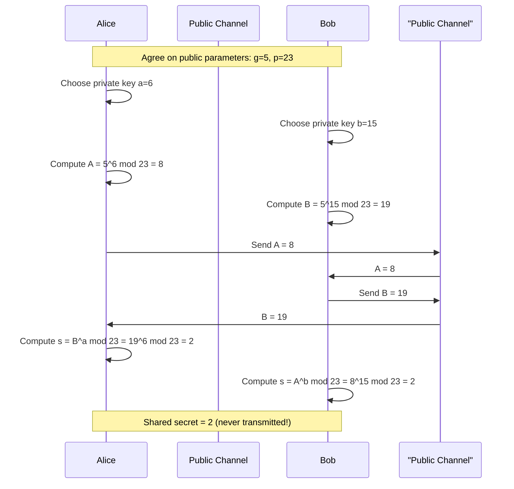

# Diffie-Hellman Key Exchange

> **The art of agreeing on a secret in public.**

Diffie-Hellman (DH) is a cryptographic protocol that allows two parties to establish a shared secret key over an insecure, fully public channel — without ever transmitting the secret itself. Introduced by Whitfield Diffie and Martin Hellman in 1976, it is the backbone of TLS, SSH, Signal, and virtually every secure protocol in use today.

---

## Table of Contents

- [The Problem](#the-problem)
- [The Intuition: Paint Analogy](#the-intuition-paint-analogy)
- [The Math: Modular Exponentiation](#the-math-modular-exponentiation)
- [The Protocol](#the-protocol)
- [Why Eve Can't Break It](#why-eve-cant-break-it)
- [Known Attacks on the Discrete Logarithm Problem](#known-attacks-on-the-discrete-logarithm-problem)
- [Security Recommendations](#security-recommendations)
- [ECDH: The Modern Variant](#ecdh-the-modern-variant)
- [Limitations](#limitations)

---

## The Problem

Alice and Bob want to communicate securely. They need a shared encryption key. But:

- They have never met in person.
- Every message they send is visible to Eve (an eavesdropper).
- They cannot physically hand each other a key.

How do you agree on a secret when everything you say is public?

---

## The Intuition: Paint Analogy

The core insight is that **mixing colors is easy, but unmixing them is hard**. This is a physical analogy for a one-way mathematical function.

```
Step 1 — Both agree on a public color (yellow):

        Alice                   Bob
          |                      |
          +----<  yellow  >------+
          |    (public, known)   |

Step 2 — Each picks a private secret color:

      [red] Alice            Bob [blue]

Step 3 — Each mixes their secret with the public color and sends the result:

      Alice sends: orange (yellow + red)  ──────►  Bob receives orange
      Bob sends:   green  (yellow + blue) ◄──────  Alice receives green

Step 4 — Each adds their own secret to what they received:

      Alice: orange + red  = brown (the shared secret)
      Bob:   green  + blue = brown (the same shared secret!)

Eve sees: yellow, orange, green — but cannot unmix them to find red or blue.
```

The shared secret (brown) was **never transmitted**. It was independently derived by both parties.

---

## The Math: Modular Exponentiation

DH replaces paint mixing with **modular exponentiation**, which has the same one-way property.

### Modular Arithmetic

The modulo operation returns the remainder of division:

```
17 mod 5 = 2
```

### The Trapdoor Function

Given a generator `g`, a prime `p`, and a private key `a`:

```
A = g^a mod p
```

- Computing `A` from `g`, `p`, and `a` is **fast** (polynomial time).
- Computing `a` from `g`, `p`, and `A` is the **Discrete Logarithm Problem (DLP)** — computationally infeasible for large primes.

This asymmetry is the entire security foundation of Diffie-Hellman.

---

## The Protocol

### Public Parameters

Both parties agree publicly on:
- `g` — a generator (small integer, commonly 2 or 5)
- `p` — a large prime number

### Step-by-Step



### Why They Get the Same Answer

The math is symmetric because exponentiation commutes under modular arithmetic:

```
Alice computes: B^a mod p = (g^b)^a mod p = g^(a·b) mod p
Bob   computes: A^b mod p = (g^a)^b mod p = g^(a·b) mod p
```

Both sides reduce to `g^(a·b) mod p`. The shared value is identical — and it was never sent over the wire.

---

## Why Eve Can't Break It

Eve observes the public channel and sees:

| Value | Known to Eve? |
|-------|:---:|
| `g` (generator) | Yes |
| `p` (prime) | Yes |
| `A = g^a mod p` | Yes |
| `B = g^b mod p` | Yes |
| `a` (Alice's private key) | **No** |
| `b` (Bob's private key) | **No** |
| `g^(a·b) mod p` (shared secret) | **No** |

To compute the shared secret, Eve would need to solve:

```
Given g, p, and A = g^a mod p — find a.
```

This is the **Discrete Logarithm Problem**. For a 2048-bit prime `p`, the search space exceeds `2^2048` — larger than the number of atoms in the observable universe. No classical algorithm can solve it in feasible time.

---
---

## See also

- [Security](Security.md) — Digital signatures, certificates, and OpenSSL commands
- [Cryptography](Security/Cryptography.md) — AES and other encryption standards
- [HTTP](Network/HTTP.md) — TLS/HTTPS relies on DH for key exchange
- [mitmproxy](mitmproxy.md) — Man-in-the-middle proxy, relevant to DH's MITM limitation

---

## References

- Diffie, W. & Hellman, M. (1976). *New Directions in Cryptography*. IEEE Transactions on Information Theory.
- Pohlig, S. & Hellman, M. (1978). *An Improved Algorithm for Computing Logarithms over GF(p)*. IEEE Transactions on Information Theory.
- Adrian et al. (2015). *Imperfect Forward Secrecy: How Diffie-Hellman Fails in Practice* — [Logjam](https://weakdh.org/).
- RFC 3526 — *More Modular Exponential (MODP) Diffie-Hellman groups for IKE*.
- RFC 7919 — *Negotiated Finite Field Diffie-Hellman Ephemeral Parameters for TLS*.
- NIST FIPS 203 (2024) — *Module-Lattice-Based Key-Encapsulation Mechanism Standard (ML-KEM)*.
