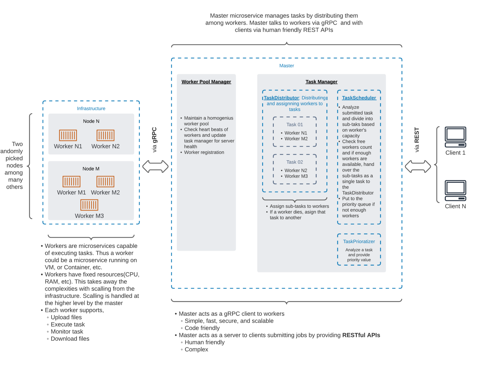
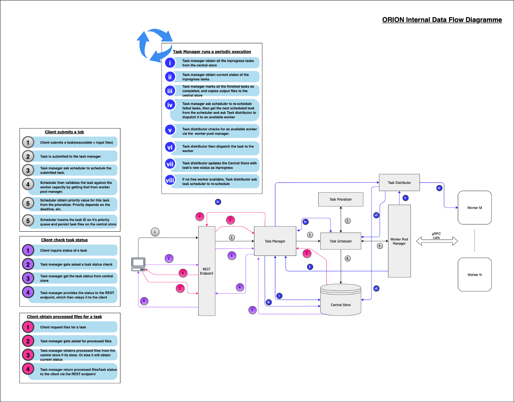

# Build a simple distributed system

Components of our system

1.  **Client** — Actual users or user agents submitting jobs
2.  **Master** — Accepts jobs from clients, orchestrate the system and get the jobs executed, and finally return expected outcomes to clients
3.  **Worker** — Accepts a job, execute it, and provide the expected outcomes.

# References
- https://towardsdatascience.com/lets-build-a-simple-distributed-computing-system-for-modern-cloud-part-one-e2b745126211
- https://github.com/crunchycookie/orion