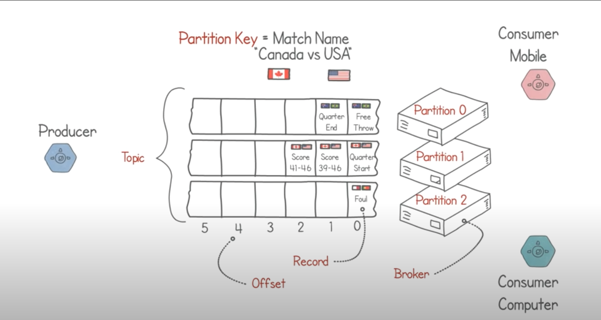

# Kafka

It’s a Distributed Steaming platform for building data pipelines and streaming application at massive scale. It is written in Scala and Java.

Event streams are organized into topics that are distributed across multiple servers called brokers. This ensure that data is easily accessible and resilient to system crashes.

Kafka combines three key capabilities so you can implement your use cases for event streaming end-to-end with a single battle-tested solution:

1. To **publish** (write) and **subscribe to** (read) streams of events, including continuous import/export of your data from other systems.
2. To **store** streams of events durably and reliably for as long as you want.
3. To **process** streams of events as they occur or retrospectively.

Kafka has its own limitations. It is quite complicated and it has steep learning curve. It not suitable for startups and ultra low latency products like trading platforms.

# Kafka Architecture

### Kafka server - Kafka broker

Producers and Consumers establish a TCP connection to the Kafka server or broker to subscribe or publish topics. 

Unlike RabitMQ, the consumers pull topics from the broker.

### Partitions

Kafka uses the concept of sharding to distribute the database.

### Consumer Groups

Do parallel processing on partitions.

### Using GO SDK

There are two libraries for communicating to Kafka in Go

- https://github.com/segmentio/kafka-go
- https://github.com/Shopify/sarama

### Kafka Go

# Kafka Usecases

## Message Queue

It serves as a highly reliable and scalable message queue.

## Activity Tracking

Kafka is ideal for ingesting and storing real-time events like clicks, views, and purchases from high traffic websites.

## Gathering Data

Kafka can consolidate disparate streams into unified real-time pipelines for analytics and storage.

## Microservice Architecture

Kafka can be used in multiple patterns in microsevice architectures. It can serves as a real-time data bus that allows different services to communicate to each other.

## Monitoring and Obervability

Kafka integrated with ELK stack can collect metrics, logs, and network data in real-time that can be aggregated and analyze to monitor the overall system health and performance.

## Big Data

Since it use a distributed architecture it can handle massive volumes of real-time data streams.

# References

- [Apache Kafka in 6 minutes](https://www.youtube.com/watch?v=Ch5VhJzaoaI)
- [What is Kafka and How does it work?](https://www.youtube.com/watch?v=LN_HcJVbySw)
- [Apache Kafka](https://kafka.apache.org/intro)
- [System Design: Apache Kafka In 3 Minutes](https://www.youtube.com/watch?v=HZklgPkboro)