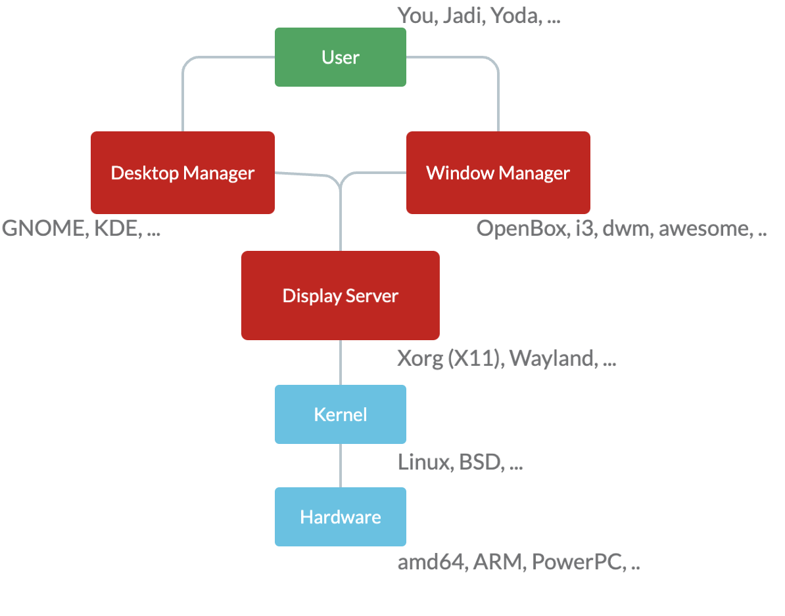

# LPIC I

# 101 - 1

## Operating System

The computer is all just some hardware. An operating system is software that manages hardware and its resources. It allocates resources to the applications.

## Firmware

Firmware is something between hardware and software. It enables that hardware to communicate with the operating system or other hardware.

The motherboard itself has firmware; the older version of this firmware was called BIOS. Nowadays, we have UEFI (Unified Extensible Firmware Interface). UEFI has a separate partition `/boot`. They're modern and fantasy.

## Peripheral Devices

### PCI (Peripheral Component Interconnect)

It enables us to add hardware boards to the motherboard.

### Gpio (General Purpose Input Output)

## sysfs

It is a pseudo-file system provided by the Linux kernel. It has information about:

- kernel subsystems
- hardware devices
- associated device drivers

> pseudo-file means that they're not on the disk‌‌ but in kernel memory.

To see `sysfs` files, you can enter `sys` directory

```bash
cd /sys/

# Network setting like IP forwarding
cat /sys/net/ipv4/ip_forwarding
```

## udev

`udev` or userspace `/dev` is a device manager for the Linux kernel. It is also a pseudo-file system. We usually use this `/dev` to manage our devices.

To see all devices:

```bash
cd /dev
```

## dbus

The D-bus is a message bus system allowing applications to talk to one another.

## proc

`proc` is just another pseudo-file system. `proc` is where the kernel keeps its setting and properties.
You can see all of these:

- IRQ - Interrupt requests
- I/O Port
- DMA
- Processes
- Network Settings
- ...

Some examples:

```bash
# Details about cpu
cat /proc/cpuinfo

# Details about memory
cat /proc/meminfo
```

> The numbers represent the processes.

## ls commands

- `lsusb` - usb devices
- `lspci` - devices connected to computer
- `lsblk` - block devices RAM/ROM/Disk
- `lshw` -

## Loadable Kernel Modules

Linux like any other OS needs drives. In Linux, most of these drivers are built-in. `.ko` files are object files used to extend the kernel of the Linux distribution.

Here are some Modules Loading commands:

```bash
# To list all modules
lsmod

# To remote a module
sudo rmmod tls

# to insert a module
sudo insmod <ADDRESS_OF_MODULE>
sudo modprobe tls
```

---

# 101 - 2

## The boot process

1. Motherboard firmware does a PowerOnSelfTest.
2. Motherboard loads the bootloader.
3. Bootloader loads the Linux Kernel.
4. Kernel loads and prepares the system and runs `init` program.
5. `init` program starts the services or other applications.

### BIOS

The motherboard itself has firmware; the older version of this firmware was called BIOS.

### UEFI

Nowadays, we have UEFI (Unified Extensible Firmware Interface). UEFI has a separate partition `/boot`. They're modern and fantasy.

EFI System partition or ESP is FAT and mounted on `/boot/efi`. Bootloader files has `.efi` extensions.

> Check /sys/firmware/efi to see if you're using UEFI or not.

### Bootloader

The bootloader initializes the minimum hardware needed to boot your system and then scans, finds, and runs the OS.

<aside>
💡  Grub is a bootloader.

</aside>

### Kernel

It is the main and core component of your operating system. It is the LINUX itself. The kernel needs some initial information to start. Those are stored in `initramfs`.

## Logs

### Kernel Ring Buffer

When the kernel is loading, there is no space to write logs yet. The kernel uses the Kernel Ring Bugger to remember and store these logs. After loading, They're also stored in `/var/log/boot` (for Debian) and `/var/log/boot.log` (for RedHat).

### dmesg

`dmesg` shows the full data from the Kernel Ring Buffer up to now. But the `/var/log/dmesg` shows the data during the boot. The Kernel is continuously logging its messages to `dmesg`.

### journalctl

It stores the `systemd` logs.

```bash
# To see the kernel logs
journalctl -k

# Boot logs
journalctl -b
```

## init

There are lots of services and daemons running in our operating system. The kernel runs `init` program and then `init` is responsible for launching those services.

> Note: having a separate program like init is a good architecture because it avoids crashing.

init systems:

- SysVinit: It is based on the Unix systems and not used much.
- systemd
- upstart: The project was started by canonical (The company behind Ubuntu) and was canceled.

```bash
# To see your init system
which init
# Read the link
ls -ltrh /usr/sbin/init
# Or
readlink -f /usr/sbin/init

# Using process to find out init system
ps -p 1
pstree | less
```

### systemd

`systemd` is a init system. `systemd` work with some units.
The units priority is

1. `/etc/systemd/system/`
2. `/run/systemd/system/`
3. `/usr/lib/systemd/system/`

You can also read this page: [systemctl in linux](https://www.notion.so/amin-mag/Systemctl.md)

```bash
sudo systemctl is-system-running
sudo systemctl --failed
```

### Units

```bash
# To see the units
sudo systemctl list-units
```

There are 12 types of units, the services are the most important ones. The `target`s consist of some services and by loading them all of its services are going to run.

```bash
# To show just a type of units
sudo systemctl list-units --type=target

# Get the default target
sudo systemctl get-default
```

All of these units are stored in files.

```bash
# List the unit files
sudo systemctl list-unit-files

# To cat the unit file.
# In my case it was in `/lib/systemd/system/cups.service`
sudo systemctl cat cups
sudo systemctl cat graphical.target
```

To enable and run these unit files (Services).

```bash
# Status of service
sudo systemctl status sshd

# Start
sudo systemctl start sshd

# Stop
sudo systemctl stop sshd

# Automatically start a service after boot
sudo systemctl enable sshd
```

### Journalctl

```bash
# Show everything
sudo journalctl
sudo journalctl --no-pager
sudo journlactl -n 100
# Show a range of time
sudo journlactl -S -1d
sudo journlactl -S -1M
# Show from the end
sudo journlactl -xe
# Just a specific type
sudo journlactl -i ntp
# Using process id to filter
sudo journlactl _PID=1234
```

### SysV

The services are located in `/etc/init.d` in systems using SysV. These are some bash scripts files.

```bash
/etc/init.d/ntpd start
/etc/init.d/ntpd status
/etc/init.d/ntpd stop
/etc/init.d/ntpd restart
```

---

# 101 - 3

## runlevels

You can run Linux on different levels. Runlevels define what tasks can be accomplished in the current state of a Linux System.

### systemd

```bash
# Each target means something
sudo systemctl list-unit --type=target

# More detail for targets
systemctl cat multi-user.target
```

1. `rescue`
   - Local systems are mounted
   - There is no networking
   - Only root user
2. `emergency`
   - Only root file system in read-only mode
   - No networking
   - Only root user
3. `reboot`
4. `halt`
   - Stop all processes
   - Halts CPU activities
5. `poweroff`

```bash
# Change the level
systemctl isolate rescue
systemctl isolate graphical

# Check system running
systemctl is-system-running
```

### SysV runlevels

Different stages for RedHat-based systems.

- 0 - Shutdown
- 1 - Single-User
- 2 - Multi-User
- 3 - Multi-User with networking
- 4 - Customized by the admin
- 5 - Multi-User with networking and graphics
- 6 - Reboot

Different stages for Debian systems.

- 0 - Shutdown
- 1 - Single-User
- 2 - Multi-User with graphics
- 6 - Reboot

```bash
# You can use init to change the mode.
# In our systems, we have init command and
# it is connected to systemd.
# Reboot
init 6

# See the history of the change mode
runlevel
```

`/etc/rc` files like `/etc/rc6.d/` contain some bash files (Linked to the real bash script files) and represent the init commands tasks.

`K` at the beginning of these files means to kill, and `S` means to start.


## Shutdown like a professional

`halt`, `reboot`, `poweroff` are some commands using systemd underlying.

```bash
# Reboot for 5 minutes later with
# the message "we are going down"
shutdown -r +5 we are going down

# Cancelation
shutdown -c

# Wall to send a message
wall hi everybody!
# Disable messagin
mesg n
# What users are logged in the system
# With their messaging status
who -T
```

`/etc/motd` is the message of the day. After ssh to the system, this message is going to be printed.

## Advanced Configuration and Power Interface

ACPI provides an open standard for the operating system to discover and configure computer hardware components. The bold part of this tool is power management.

---

# 102 - 1

## Unix Directories

Understanding Filesystem Hierarchy Standard or FHS can help you find your programs, configs, logs, or other files.

- `/bin`: Essential executables, It contains some binary files that are essential for the system.
- `/sbin`: Essential executables for root.
- `/lib`: Shared code between binaries, `/bin` binaries, and `/sbin` binaries may share some codes.
- `/usr`: Second Hierarchy
  - `/usr/bin`: Non-Essential installed binaries.
  - `/usr/local/bin`: Locally compiled binaries.
- `/etc`: Editable text config, all of the configurations are here.
- `/home`: User data
- `/mnt`: Mount point for mounting a filesystem temporarily
- `/boot`: Files need to boot the system like the kernel.
- `/dev`: Device files
- `/opt`: Optional and add-on software.
- `/var`: Contains variable files that will be changed as the OS is used. Like logs and cache files.
- `/tmp`: Contains files that won't be persisted between reboots.
- `/proc`: Imaginary directory that doesn't exist on the disk. It is created by the memory and contains information about processes.
- `/root`: Home of the root user (For security)

## Partitions

Before formatting, you need to partition your hard disk.

In the Linux world, the devices are defined as `/dev/`. Your flash drive will be mounted at `/mnt/`. So everything becomes part of the `/` tree. 

You can create different partitions for different directories of the root; for example, you can create:  

- 250MB partition for your `/boot/`.

- 905GB partition for your `/home/`.

- 50GB partition for your `/` (The rest of the directories) - In this case, when you want to change your Operating system, you need to install it on this partition. You can easily mount your old partition `/home/` and not be worry about your files.

> In BIOS you could have upto 4 partitions on each disk. (Although you can create a extended partition, then create another 4 logical partition on that.)

### Tools

#### Fdisk command

```bash
# Run fdisk for sda disk
sudo dfisk /dev/sda
# Command (m for help):
# p -> shows the partitions
# q -> exit
```

#### Mount

```bash
sudo mount | grep sda 
```

#### Parted

```bash
sudo parted /eve/sda p
# You can use the graphical version Gparted
```

### LVM

What about having a 20TB hard drive? The answer is LVM or Logical Volume Managment. You can connect ten 2TB hard disk and use LVM to create a single virtual hard drive. After that you can start to partition this 20TB virtual LVM hard drive.

You can easily connect more hard drives and make each one of your partitions bigger.

The main concepts:

- Physical Volume (or PV)

- Volume Group (or VG)

- Logical Volume (or LG)

```bash
# It is not for LPIC 1
# You can use the lv command
lv
```

## Design Hard disk layout

### swap

The swap is like an extended memory. Kernel will page memory and then it can execute a program that need more memory than the system has. (Although it is slow)

### boot

Having separate partition for `/boot` ?

1. You can recover your system using `/boot` partition.

2. You can not encrypt `/boot` or load it from network because the UEFI or BIOS needs to read the data from this partition, but by separating `/boot/` and `/` partitions you can encrypt just `/` partition, or you even can put the `/` in another disk drive. (It is much cleaner.)

---

# 102 - 2

## Grub 1

Common Configurations

```bash
# The forground and background of items
color= 

# The default OS
default=

# If it fails...
fallback=

# Graphical options
hiddenmenu=
splashimage=

# Timeout for default
timeout=

# Authentication
password=

# Default OS is the previous loaded OS
savedefault=
```

For each one of operating systems, You need to configure these items.

```bash
# The name of the OS.
title=
# Where the /boot directory is.
root=
kernel=
initrd=
rootverity=
chainloader=
```

You need to apply these changes.

```bash
grub-install /dev/sda1
```

## Grub 2

It is more like a programming language.

```bash
set default ="0"
menuentry "Fedora" {
	# Wher the /boot is
	set root=<DISK>
	# Linux Kernel
	linux <KERNEL>
	# Initramfs
	initrd <INITRD>
}
menuentry "Windows" {
	chainloader
}
```

To aggregate seperate config files and update the new configuration file.

```bash
grub2-mkeconfig > /boot/grub2/grub.cfg
```

### Grub CLI

```bash
# Print everything even the disks
ls
ls (hd0.gtp3)/

# To load the kernel with CLI
linux <PATH-TO-KERNEL> ro root=<BOOT-DIR>
initrd <PATH-TO-INITRD-IMAGE>

# Start to boot the kernel
boot
```

---

# 102 - 3

## Linking 

When you create your program, you use others codes known as a library. The process of using these libraries is called linking.

### Static Linking

It's when you add the library to your executable program.

- It is easy to run. We are sure that it will be executed.
- It needs lots of disk storage.
- When the library is updated, your executable program won't be updated.

### Dynamic Linking

It tells the operating system that it needs this library. Linux dynamic libraries have names like `lib<LIB_NAME>.so.<VERION>` located at places like `/lib/`, `/lib64/` or `/usr/lib/`.

- It needs a small amount of disk storage.
- It's more secure because your program will also be updated when the library is updated.

To check the dependencies

```bash
# Shows the libraries you need to run the program
ldd /usr/bin/ls
```

The configuration specifies where to find the libraries.

```bash
cat  /etc/ld.so.conf
```

There is a cache file that has a better structure for searching.

```bash
# To recreate the cache file
sudo ldconfig -v

# Show the cache file
sudo ldconfig -p
```

To analyze an ELF file

```bash
# To link the libraries manually
/usr/lib64/ld-linux-x86-64.so.2 /usr/bin/ls

readelf -Wl /usr/bin/ls
```

#### Steps of finding libraries

1. `LD_LIBRARY_PATH` environment variable
2. Programs `PATH`
3. `/etc/ld.so.conf`
4. `/lib/`, `/lib64/`, `/usr/lib/`, `/usr/lib64/`

---

# 102 - 4

## Debian package management

Package managers are responsible for searching the repositories, installing packages and their dependencies, resolving conflicts and updating system.

In Debian-base distros, there are some package manager softwares like

- apt-get
- dpkg (lower level)
- apt (easy to use)

Debian packages are in the format of `<APP_NAME>-<VERSION>-<ARCH>.deb`. You can read more [here](DPKG.md).

### apt

You can find the apt sources in `/etc/apt/sources.list` or `/etc/apt/source.list.d`. 

```bash
# deb <SOURCE_PATH> <VERSINO_TYPE> <RESOURCES...>
# SOURCE_PATH can be URL or cdrom or ....
deb http://ir.archive.ubuntu.com/ubuntu/ focal-updates main restricted
```

The `source.list.d` is a directory contains list of `.list` source files.

#### Update package's lists

It looks at the `.list` source files and update the list of the packages.

```bash
sudo apt-get update

# After updating the list of packages 
# you're able to install a package.
sudo apt-get install vlc
```

These caches are in `/var/cache/apt`.


#### Install/Uninstall a package

Here are some basic commands.

```bash
sudo apt-get install <APP_NAME>

# To simulate the installation
sudo apt-get install -s <APP_NAME>

# To download the packages and save them in cache
sudo apt-get install --download-only <APP_NAME>

# To install dependencies haven't been installed
sudo apt-get install -f

# To download the .deb files
apt-get download <APP_NAME>

# To uninstall a package
sudo apt-get remove <APP_NAME>

# Remove with the configurations
sudo apt-get purge <APP_NAME>

# To remove unused packages (dependencies)
sudo apt-get autoremove
```

#### Search packages

```bash
# apt-get
apt-cache search vlc
# apt
apt search vlc
```

#### Upgrade

It compares the installed packages with the local repository and installs new ones if there is a newer version in the local repository.

```bash
sudo apt update
sudo apt upgrade

# Upgrade the whole OS
sudo apt-get dist-upgrade
```

### dpkg

It's a tool for installing a `.deb` file.

```bash
# Install the .deb file
sudo dpkg -i <APP_NAME>.deb

# Get the list of installed packages
sudo dpkg -l

# Get information
sudo dpkg -I <APP_NAME>.deb

# Remove a package
sudo dpkg -r <APP_NAME>

# Remove with the configurations
sudo dpkg -P <APP_NAME>

# Show which dependencies binary files were installed
sudo dpkg -L <APP_NAME>

# Show which app installed the package.
# It's the opposite of the previous command.
sudo dpkg -S <APP_NAME>
```

### Reconfigure packages

```bash
sudo dpkg-reconfigure <APP_NAME>
```

# 102 - 5

## Redhat package management (RPM, YUM)
All `.rpm` files just like `.deb` files can be installed with RPM commands.

> We also have something called `zypper` for SUSE linux.

## Yum

- Yum is a higher level tool that can install packages for you.  The yum repositories are in `/etc/yum.repos.d/`.
- You can configure the behavior of the Yum package manager with `/etc/yum.conf`.
- Yum doesn't have a debain `update` concept.
- The `dnf` is a newer package manager and it's the Fedora undelying package manager.


### Install/Uninstall a package

```bash
sudo yum -y install vlc
sudo yum localinstall vlc.rpm
sudo yum groupinstall "KDE Plasma Workspaces"

sudo yum -y reinstall vlc

sudo yum remove vlc
```

### Upgrade a package

```bash
sudo yum update
# This one will remove the obsolate packages
sudo yum upgrade
```
 
### List installed packages

```bash
sudo yum list
```

###  Get information about packages

```bash
# Search in repository
sudo yum search vlc

# Get some general information about the package
sudo yum info vlc

# Show dependencies
sudo yum deplist vlc
```

## RPM Files

The `.rpm` files are technically a `cpio` file. You can use `rpm2cpio` to convert to a `cpio` file.

```bash
# Create the file
rpm2cpio <RPM_FILE> > file.cpio
# Extract
cpio -idv < file.cpio
```

Anyway, here are some basic RPM commands.

```bash
# To install or upgrade
# -v is for verbose
# -h for progress bar
sudo rpm -Uvh <RPM_FILE>

# To install
sudo rpm -iv <RPM_FILE>

# To erase
sudo rpm -ev <RPM_FILE>

# To see the signitures
sudo rpm -kv <RPM_FILE>

# To verify the installed package
sudo rpm -Vv <RPM_FILE>
```

### Query

```bash
# To query
sudo rpm -q <RPM_FILE>
# Config files
sudo rpm -qc <RPM_FILE>
# All Installed files
sudo rpm -ql <RPM_FILE>
# Package information
sudo rpm -qc <RPM_FILE>
# Installed packages
sudo rpm -qa 
# Which packages provides this binary
sudo rpm -q --whatprovides <RPM_FILE>
# Show dependencies
sudo rpm -qR <RPM_FILE>
```


# 102 - 6

## Virtualzation

We need Hypervisor is to run a virtual machine.

> To see the CPU information you can use `lscpu` or `cat /proc/cpuinfo`.

### Hypervisors

There 2 types of hypervisors.
- Native or bare metael  Hypervisors
- Hosted Hypervisors

#### Native Hypervisor

The hypervisor directly runs on the hardware and has different kinds of operating systems. Like kvm, Xen, Hyper-V.

#### Hosted Hypervisors

The operating system is installed on the hardware and on the top of that there is a hypervisor with different kinds of operating systems. Like virtualbox, vmware.

### Open Virtualization Format

It's easy to move machines between hypervisors using Open Virtualization Format or OVF. It may include several files. Open Virtualization Archive or OVA is a single file that container all previous standard OVF files.

### Cloning Machine

When you clone a machine you should take care of some network stuff before booting. Here are some examples:

- Host Name 
- MAC Address
- Network Interface Controller
- Machine ID
- Encryption Keys
- HDD UUID
- ...
 
### Containers

This is an OS-Level virtualization. Containes against virtual machines only install the libraries and binaries to run an application. There is no operaing system. Here we need a container engine like Docker to create containers.

# 103 - 1

There are different kinds of shells for example, `bash` (the most common one), `dash`, `zsh`, `ksh`, and so on.

```bash
# To see the name of shell
ls -ltrh /bin/bash
echo $SHELL
```

To see if a command is an internal command or external, you can use `type` command.

```bash
type cd

# Get more info about commands
which vi
whereis vi
whatis vi
```

To ignore special characters like `*` or `$` you can use `\`.

> You can find most of this section in [Linux Commands](Linux%20Commands.md)
> 

# 103 - 2

## Work with streams

- stdin
- stdout
- stderr

> You can find most of this section in [Linux Commands](Linux%20Commands.md)
> 

### Hashes

- md5sum
- sha256sum
- sha512sum

# 103 - 3

## Perform basic file management

### Wildcards

- * - match everything 
- ? - match any single character
- [ABC] or [A-Z] - match bunch of characters
- [!X] - match not having a character

```bash
# copy all of the files
cp ./* /tmp

# list all txt files
ls ./*.txt
```

> ⚠️ You can find most of this section in [Linux Commands](Linux%20Commands.md)
> 


> ✍️  `/dev/zero` is a device that always return zero.
> 

### Compression

- gzip
- bzip2
- tar
- cpio

> ⚠️ You can find most of this section in [Linux Commands](Linux%20Commands.md)
> 

# 103 - 4

## Use streams, pipes and redirects

### Streams

Linux has three kinds of stream: stdin(code=0), stdout(code=1), and stderr(code=2) which can be read from or write on serveral devices such as console, printer, or...

| Operator    | Usage                           |
| ----------- | ------------------------------- |
| `>`           | Redirects STDOUT to a file|
| `>>`          | Appends STDOUT to a file|
| `2>`   | Redirects STDERR to a file|
| `2>>`   | Appends STDERR to a file|
| `&>`   | Appends STDOUT & STDERR to a file|
| `&>>`   | Appends STDOUT & STDERR to a file|
| `<`   | Redirects STDIN from a file|
| `<>`   | Redirects STDIN from a file and send the STDOUT to it|


```bash
# To redirect stdout and stdin in separate files
# Consider not having x* file in current directory
# And having t* file in current directory
ls x* t* > lsresult 2> lserr
```

> ✍️  `&0`, `&1`, `&2` is defined after redirecting and it refers to the destination.
> 

```bash
ls > lsresult 2>&1
```

> ✍️  `/dev/null` ignores any streams that are redirected to it.
> 

```bash
# To just ignore the output
# To redirect stdout and stdin in separate files
# Consider not having x* file in current directory
# And having t* file in current directory
ls x* t* > lsresult 2>/dev/null
```

#### Here documents `<<`

You can use `<< EOF` to give multiple line string to a command. You can use anything instead of using `EOF`.

```bash
cat << EOF > save.txt
```

### Pipe

```bash
ls -1 | wc -n
```

Do something with each one of the results

```bash
ls | xargs echo
```

# 103 - 5, 103 - 6

## Managing processes

Status
- Foreground
- Background
- Running
- Stopped

You can use `CTRL+C` to terminate or `CTRL+Z` to stop a process which is run in the foreground.

```bash
# For see the procecess in the current session
# Jobs with `&` at the end mean running in background
jobs

# With process id
jobs -l
```

To resume a job or process in the foreground

```bash
# Resume the last process (consider the `+` sign)
fg 

# Choose between multiple processes
fg %2
```

To resume a job in the background

```bash
# Resume the last process (consider the `+` sign)
bg 

# Choose between multiple processes
bg %2
```

Or run a process in the background at first

```bash
xeyes &
```

These foreground and background process are alive until the session is closed. If you want to keep them alive even if the parent are killed, you need to use `nohup`.

```bash
nohup xeyes
```

### Niceness and priority

Niceness is a number between -20 and 19. If the niceness is a big number then it will have less priority to gain resources. A process will have `niceness=0` when it gets start.

### Signals

- 1 - HUP
- 15 - TERM
- 9 - KILL

```bash
# Kill a process
kill -9 1500

# Kill all processes whoses command is exactly `xeyes`
killall xeyes
# Kill all process which have a kind of command
pkill xeye
```

### Monitoring processes

There are some useful commands for monitoring the system.

```bash
top
htop
uptime
free -h
```

#### top

It shows the load average in the first line. The numbers represent the load averege in recent 1, 5, and 15 minutes. The number shows how many process are requested in the system and it should be fewer than the number of CPU cores. (If the load number is higher than the number of CPU, some processes should wait to be processed and it can have some troubles for the system)

# 103 - 7

## RegEX

```bash
grep funk words.txt
grep j..a words.txt

```


# 104 - 1

## Block devices

A nonvolatile storage device that can be accessed in any order.

```bash
# To see all blocks
lsblk
```

## Create partitions

To partition your disks you can use `fdisk` for older systems that use BIOS and MBR. You can use `gdisk` for systems that use UEFI and GPT.

```bash
# Start partitioning
fdisk /dev/sda

# p for listing partitions
# n for creating a new partition
# t for changing the type of the partition.
```

### GParted/Parted

Parted has more features than `gdisk` or `fdisk`. For example, it can resize the partitions.

## File Systems

- ext2 
	- Doesn't have journaling.
- ext3 
	- It has journaling.
	- Each file size could be 1TB and the max filesystem size is 16TB.
- ext4
	- It has journaling.
	- Each file size could be 16TB and the max filesystem size is 1EB.
- XFS
	- It has journaling.
	- caches to RAM.
	- Max filesystem and file size are 8EB.
- swap
- VFAT/FAT32
	- Doesn't have journaling.
	- It is simple and any device can recognize this filesystem.
- exFAT
	- It is simple and any device can recognize this filesystem.
- btrfs
	- A new high-performance filesystem.
	- It has a RAID
	- Create partitions from multiple physical hard disks. (LVM)
	- It has a Snapshot feature.

## Formatting a partition

```bash
# Formatting to ex3 (Calling /sbin/mkfs.ext3)
mkfs -t ext3 /dev/sda1
```

# 104 - 2

## Maintaining the integrity of filesystems

### iNode

In `ext` filesystems, the filesystem store more information about files like the file owner or permissions. This data is stored in the `inode` table.

> See more about [df](Linux%20Commands.md##df) and [du](Linux%20Commands.md##du) on the Linux commands page.

## Repairing filesystem

> See more about [fsck](Linux%20Commands.md##fsck), [tune2fs](Linux%20Commands.md##tune2fs), and [xfs](Linux%20Commands.md##xfs) on the Linux commands page.

# 104 - 3

## Control Mounting and Unmounting

Linux systems usually mount the flash memory to the `/media` or `/mnt` directory.

> See more about [mount](Linux%20Commands.md##mount) and [umount](Linux%20Commands.md##umount) on the Linux commands page.

## fstab

If you want to have a custom configuration for your mount, you can edit the `/etc/fstab` file.

## Systemd

Systemd has a mechanism that can mount a disk in the boot time. These units have `.mount` name.

# 104 - 5

## Manage file permissions and ownership

File access in this format is

$$
Owner-Group-Others
$$

Each one of the items consists of 3 bits which is

$$
Read-Write-Execute
$$

For example, 755 means

- Read, Write, and Execute for the owner.
- Read and Execute for group and others.

> See more about [chmod](Linux%20Commands.md##chmod), [umask](Linux%20Commands.md##umask), [chown](Linux%20Commands.md##chown), and [chgrp](Linux%20Commands.md##chgrp) on the Linux commands page.

###  SUID

In some cases, like `passwd` we have `s` permission. This means that when the file is executed the access mode in executing that file is equal to the owner. For example, when you execute passwd, it has the access mode of root.

### umask

the `umask` is responsible for setting permission for new files. The mechanism is that 666 minus `umask` number will be the default permission.

# 104 - 6

## Create and change hard and symbolic links

The hard link points to the file on the disk, but the Soft link point to the file itself. Removing the file hard link works properly.

# 104 - 7

## Find system files and place files in the correct location

### File Hierachy Standard (FHS)

- `/bin`: Essential executables, It contains some binary files that are essential for the system.
- `/sbin`: Essential executables for root.
- `/lib`: Shared code between binaries, `/bin` binaries, and `/sbin` binaries may share some codes in it.
- `/usr/bin`: Non-Essential installed binaries.
- `/usr/local/bin`: Locally compiled binaries.
- `/etc`: Editable text config, all of the configurations are here.
- `/home`: User data
- `/boot`: Files need to boot the system like the kernel itself.
- `/dev`: Device files
- `/opt`: Optional and add-on software.
- `/var`: Contains variable files that will be changed as the OS is being used. Like logs and cache files.
- `/tmp`: Contains files that won't be persisted between reboots.
- `/proc`: Imaginary directory that doesn't actually exist on the disk. It is created by memory and contains information about processes.

### PATH

The Linux operating system searches the command in the paths and tries to find the specific command. You can set these directories in the PATH environment variable.

# 105 - 1

## Shells

- Login Shell
- Interactive Shell: 
- Non-Interactive Shell: Some shel ls created to be non-interactive while running a specific command like `ping`.

### Login Shell

The shell that you get after login into system. The shell environment is 
- `/etc/profile`
- `/etc/profile.d/*`
- `/home/USERNAME/.bash_profile`, `/home/USERNAME/.bash_login`, `/home/USERNAME/.profile`,  `/home/USERNAME/.bashrc`

### Interactive Shell (non-login)

Open terminal via GUi. The shell environment is 
- `/etc/bash.bashrc` or `/etc/bashrc`
- `/home/USERNAME/.bashrc`

### Non-Interactive Shell

Some shell ls created to be non-interactive while running a specific command like `ping`. The shell environment is `$BASH_ENV`.

> **Note**: the `/etc/skel` contains the initial default profiles which are used for each new user. The script `.bash_logout` is executed each time a user logs out.

# 105 - 2

## Shell Scripting

- `command_a;command_b`: normally executes the `command_a` and after than it executes the `command_b`.
- `command_a && command_b`: executes the `command_b` only if `command_a` is executed successfully.
- `command_a || command_b`: executes `command_a` and if it is not successful then executes `command_b`.

bash create a process for executing the shell script. Using `exec` command it will be replaced by the bash process. 

```bash
exec script.sh
```

### Conditions

- `-f` Does file exist?
- `-s` Does file exist and is size of file more than zero?
- `-x` Does file exist and is it executable?

```bash
read coffee
if [ $coffee -eq "y" ]; then
    echo "You're awesome."
elif [[ $USER == "bernard" ]]; then
    echo "Bernard always win this game."
else
    echo "Do nothing."
fi
```

# 106 - 1



## Xhost

This command controls the access to the X server.

```bash
# Give access to all
xhost + 
# Or give access to a specific IP
xhost +192.168.32.12

# Limit the access 
xhost -
```

To see the current display status

```bash
echo $DISPLAY
```

But this is not secure. This mechanisam has multiple security issues.

## xauth

The difference is that xauth is based on secrets and not based on IP addresses.

# 106 - 2

## Graphical Desktops

- KDE
- Gnome
- Xfce

## Remote Desktop

For running a single application, if the `X11Forwarding yes` is configured in `/etc/ssh/sshd_config` you can remote desktop using this command.

```bash
ssh -X server_ip.address.net
```

### VNC

It is an old protocol that works on most of computers and the default port is 5900+DisplayNumber. It has multiple security issues.

### Spice

It uses low amount of CPU and it is faster. The usage is limited to some kinds of computers.

### RDP

You can install applications like `xrdp` that runs on 3389. The connection is encrypted and there are many open RDP clients.

# 107 - 1

## Manage user accounts and related system files

> See more about [adduser](Linux%20Commands.md##adduser), [useradd](Linux%20Commands.md##useradd), [usermod](Linux%20Commands.md##usermod), and [userdel](Linux%20Commands.md##userdel)  on the Linux commands page.

## Manage user groups and related system files

> See more about [groupadd](Linux%20Commands.md##groupadd), [groupmod](Linux%20Commands.md##groupmod), and [groupdel](Linux%20Commands.md##groupdel)  on the Linux commands page.

# 107 - 2

## Automate system administration tasks by scheduling jobs

### Cron Job

`Cron` reads the configuration files for a list of commands to execute. The daemon uses a specific syntax to interpret the lines in the `crontab` configuration tables.

To be able to set up a cron job, we need to understand the basic elements that make up this syntax. The standard form for a crontab line is as follows:

```bash
# MIN HOUR DOM MON DOW CMD
# MIN	Minute field	0 to 59
# HOUR	Hour field	0 to 23
# DOM	Day of Month	1-31
# MON	Month field	1-12
# DOW	Day Of Week	0-6
# CMD	Command	Any command to be executed

# The third option `output` is optional and gathers the output in a file
a b c d e /directory/command output
```

#### Using special values and characters

For efficiency, cron syntax also uses operators. Operators are special characters that perform operations on the provided values in the cron field.

- **An asterisk (\*)** stands for all values. Use this operator to keep tasks running during all months, or all days of the week.
- **A comma (,)** specifies separate individual values.
- **A dash (–)** indicates a range of values.
- **A forward-slash (/)** is used to divide a value into steps. (*/2 would be every other value, */3 would be every third, */10 would be every tenth, etc.)

Here is an example of special values that schedule a yearly job.

```bash
# Keyword	Equivalent
# @yearly	0 0 1 1 *
# @daily	0 0 * * *
# @hourly	0 * * * *
# @reboot	Run at startup.
# For example
@yearly /home/ramesh/red-hat/bin/annual-maintenance
```

> See more about [cron](Linux%20Commands.md##cron) on the Linux commands page.

In `/etc/crontab`, you can also write some cron jobs as a root user. This file also specify the username in addition to the command.

Moreover, In `/etc/` there are some directories that you can set jobs for specific intervals like `/etc/cron.weekly`, `/etc/cron.hourly`, etc. The difference is that you can directly copy your shell script in this directories.

### At

You can Also use `at` to schedule a job for a specific time.

> See more about [at](Linux%20Commands.md##at) on the Linux commands page.

### Managing cron access 

There 4 files for managing access of `cron` and `at` commands.

- `/etc/cron.allow`: the whitelist of users that can use cron jobs
- `/etc/cron.deny`: the blacklist of users that can not use cron jobs
- `/etc/at.allow`: the whitelist of users that can use at jobs
- `/etc/at.deny`: the blacklist of users that can use at jobs

### systemd & systemd-run

Systemd has some timers and the timers are in `/etc/systemd/`. You can filter the timers using

```bash
find . -iname '*.time*'
```

The structure of a timer file is like `/etc/systemd/system/timers.target.wants/logrotate.timer`.

```bash
[Unit]
Description=Daily rotation of log files
Documentation=man:logrotate(8) man:logrotate.conf(5)

[Timer]
OnCalendar=daily
AccuracySec=1h
Persistent=true

[Install]
WantedBy=timers.target
```

The timers automatically run the service which are the name exactly same with the timer's name. In this case it will run the `logrotate.service` service.

There are two kinds of timers you can set

#### reald-time timer

You can set the exact time like this

```bash
On-Calendar=DOW YYYY-MM-DD hh-mm-ss
```

> **Note**: You can also use characters like `*`, `/`, and `,` just like in cron jobs.

A unique special character which is only in `systemd` is `..`. In this example, you can say the first Saturday of each month the timer will be triggered.

```bash
OnCalendar=Sat *-*-1..7 02:42:00
```

You can also use some keywords for iterations such as `hourly`, `daily`, `weekly`, `monthly`, `monthly`, and `yearly`.

#### Monotonic timer

This kind of timer is activated after some time has elapsed from a specific start point.

- `OnActiveSec`: after unit activation
- `OnBootSec`: after system boot
- And there some other keywords that you can search...

> See more about [systemd timers](Linux%20Commands.md##systemd-timers) on the Linux commands page.

As you can guess, the outputs and log of timer is in `journalctl`.

#### Temporary timer

It is possible to use `systemd-run` to schedule a task temporary.

> See more about [systemd timers](Linux%20Commands.md###systemd-run) on the Linux commands page.

# 107 - 3

## Date and time

This section is about getting information about date and time and how to change the timezone. For changing the timezone you can either use the `tzselect` command or you can change the link of the `/etc/localtime`.

> See more about [cal](Linux%20Commands.md##cal), [date](Linux%20Commands.md##date), [timedatectl](Linux%20Commands.md##timedatectl), and [tzselect](Linux%20Commands.md##tzselect) on the Linux commands page.

To the information about the preferred formats in language.

## Localization

```bash
locale
```

This will show some variables that is related and you can configure the locale in `/etc/locale.conf`.

```bash
LANG=en_US.UTF-8
LANGUAGE=
LC_CTYPE="en_US.UTF-8"
LC_NUMERIC="en_US.UTF-8"
LC_TIME="en_US.UTF-8"
LC_COLLATE="en_US.UTF-8"
LC_MONETARY="en_US.UTF-8"
LC_MESSAGES="en_US.UTF-8"
LC_PAPER="en_US.UTF-8"
LC_NAME="en_US.UTF-8"
LC_ADDRESS="en_US.UTF-8"
LC_TELEPHONE="en_US.UTF-8"
LC_MEASUREMENT="en_US.UTF-8"
LC_IDENTIFICATION="en_US.UTF-8"
LC_ALL=en_US.UTF-8
```

You might see this line of code in scripts to avoid inconsistency between codes because of language (for example the order of characters or dates).

```bash
# It is a kind of contract to set the LANG to C
export LANG=C
```

## Character Encoding

To show the characters of other languages, systems start to use another character encoding that supports more number of characters.

- ACSII
- ISO-8859
- UTF-8

> See more about [iconv](Linux%20Commands.md##iconv) on the Linux commands page.

# 108 - 1

## Maintain system time

Systems have a hardware clock that can maintain the time even if the system is off. These clock are not accurate and they can be some seconds different from the accurate time.

```bash
# To see the hardware clock
hwclock
```

The OS also has a mechanism to keep the time accurate by using a protocol called NTP. (ntpd and chrony are two famous implementations of this protocol)

## NTP

### ntpd

An ntp service controls and updates the time with global time. You should either use the `ntp` service or `ntpdate` to keep your system time updated. You can not use both.

The configuration of `ntp` service is in `/etc/ntp.conf`. You can add your time pools in this file.

> **Note**: If `ntpd` recognizes a large amount of time difference it may not change the time automatically.

### chrony

Another alternative that nowadays personal systems use is chrony. You can configure this service using `chrony.conf`.

# 108 - 2

## System logging

The previous tools for logging in Linux were `syslog` and `syslog-ng`. Nowadays, `rsyslog` is usually used. The logs are usually stored in `/var/log` directory. 

- `/var/log/auth.log`: Authentication processes like cron jobs, failed logins, sudo information, etc.
- `/var/log/syslog` or `/etc/log/messages`: It is the place for most logs if a specific log file is not provided in `/etc/rsyslog.conf`.
- `/var/log/debug`: Debug information from programs.
- `/var/log/kern.log`: Kernel messages.
- `/var/log/utmp`, `/var/log/wtmp`: These are some binary logs that maintain successful logins.
- `/var/log/btmp`: Failed logins.
- `/var/log/faillog`: Failed authentication attempts.
- `/var/log/lastlog`: Date and time of recent user logins.

## rsyslog

`rsyslog` is a service in Linux systems. The configuration of this service is in `/etc/rsyslog.conf`.

### Rules

Rules in the configuration have facility, priority, and action. For example, if the cron facility has a warning log, then write in `/var/log/cron-warn.log`

```bash
cron.warning   /var/log/cron-warning.log

# You can use * for all cases
cron.*         /var/log/cron.log
```

Actions can be a file to save the log, a username to print on `tty` of the user, or an IP address to send the log to another `rsyslog`.

> **Note**: You need to search more about this topic and there are a lot of capabilities for this service.

### logrotate

`logrotate` is a tool using cron jobs and responsible for compressing and maintaining the aggregate log in a Linux system. The configuration of this tool is in `/etc/logrotate.conf`.

## journald

It is a newer tool for observing system's logs. You can see all of `journald` logs using 

```bash
journalctl
```

> **Note**: You can configure the `journald` in `/etc/systemd/journald.conf`.

### journald configuration

By changing the configuration file you can modify the behavior of the `journald`. For instance, You can set the method of storing the logs in the configuration.

`Storage=auto` -> If `journald` discover the path `/var/log/journal`, it create a directory based on the machine ID and store the logs on disk. Otherwise, it stores the logs in memory.
`Storage=volatile` -> It stores the logs in the memory.
`Storage=persistent` -> it stores the logs on disk.
`Storage=none` -> Does not store anything.

There are also multiple configurations about storing logs on disk.

`SystemMaxUse` -> The maximum size that can be dedicated to storing logs. It is also possible to mentions a percentage of remaining free disk.
`SystemKeepFree` -> It doesn't matter how much to store the logs, but always keep this amount of disk free.
`SystemMaxFileSize` -> The restriction of large file size.

> **Note**: In case you are storing the logs in the memory, there are exactly the same configs like `RuntimeMaxUse`, `RuntimeKeepFree`, `RuntimeMaxFileSize`.

# 108 -3

## Main Transfer Agent

MTAs are programs which handle emails in Linux operating system. There some options for MTAs that we are going to examine here.

- `sendmail`: It is one of the oldest options. This program is a heavy one and the configuration is complex.
- `exim`
- `postfix`: This is a new alternative to `sendemail` that can be a more valid option for setting up a mail server.
- `qmail`

To install the basic requirements

```bash
sudo apt update
sudo apt install postfix bsd-mailx
```

> **Note**: You can create a file `.forward` in the home directory, in case that you want MTA to forward your emails to another email.

# 108 - 4

## Managing printers and printing

`CUPS` is the main package for controlling and managing printers and printing. `/etc/cups` contains the `CUPS` configurations.

> See more about [CUPS](Linux%20Commands.md##) on the Linux commands page.

# 109 - 1

## Fundamental of internet protocols

**TCP/IP**: `TCP` is the protocol of packets and how the data is transmitted. `IP` is a protocol that connect the computers together and create a network by defining an IP for each system. It also includes `UDP`, `ICMP`, `DNS`, etc.

> It is essential to know about IP and range of submask for this module. Also, this module contains some basic information about protocols like TCP, UDP, and ICMP.

### Ports

You can look at the `/etc/services` to see port numbers and their usage.

# 109 - 2

## Persistent Network Configuration

### NIC or Network Adapters

NIC represents a physical network adapter that kernel can recognize. You can use `ip` commands to see or make some changes to the IP address. `ifconfig` is also another older command that can be used.

> See more about [ip](Linux%20Commands.md##ip), [ifconfig](Linux%20Commands.md##ifconfig), and [nmcli](Linux%20Commands.md##nmcli) on the Linux commands page.

### Hostname

You can change the host name by editing `/etc/hostname`.

> See more about [hostname](Linux%20Commands.md##hostname) and [hostnamectl](Linux%20Commands.md##hostnamectl) on the Linux commands page.

You can change the others hostname by editing `/etc/hosts`. Open the `/etc/hosts` and add the name and IP address. This mapping is called name resolution.

```python
192.168.1.11	db
```

### DNS Configuration

On the other hand, if your computer wants to translate the names and domains to the IP addresses, it uses the `/etc/resolv.conf`.  

Name Resolution is an old solution for handling the domain name system. We use some DNS servers with all of these domain names and IP addresses. To add a dns server, change the `/etc/hosts`.

```python
nameserver		192.168.1.100
# You can add more.
# You can also set this on your DNS server
# to forward other names to a global DNS server
nameserver		8.8.8.8
# For any name search the NAME.jadi.net
domain jadi.net
# For any name search NAME.mycompany.com or NAME.prod.mycompany.com
search 			mycompany.com	prod.mycompany.com
```

> This file can be managed by network managers or `resolvctl`. So your changes might be temporary.

### Block a server

Sometimes you may need to block the connection with specific servers. The file `/etc/hosts` is the one gathering information. If you want to block a server you should add lines to this file.

```bash
# First open the file
sudo vim /etc/hosts
```

To block them

```
# Then Add these lines
0.0.0.0   www.example.com
0.0.0.0   example.com
::0       www.example.com
::0       example.com
```

### nsswitch

You can config the order of name/domain resolution. You can edit the priority of that by editing the `/etc/nsswitch`. By default, first computer search for the host in `/etc/hosts` (`files`) and then search it in the `/etc/resolv.conf` (`dns`).https://github.com/

# 109.3

## Basic Network Troubleshooting

You can use `ip`, `ifconfig`, and `ping` command to start troubleshooting from the client side. The first step is to see whether you can see the default gateway or not.

> See more about [ip](Linux%20Commands.md##ip), [ifconfig](Linux%20Commands.md##ifconfig) and [ping](Linux%20Commands.md##ping) on the Linux commands page.

`netstat` and `ss` are other useful command for troubleshooting. Specially, when you want to investigate the local machine.

> See more about [netcat](Linux%20Commands.md##netcat) and [ss](Linux%20Commands.md##ss) on the Linux commands page.

# 109.4

## Configure the Client DNS

This is all about configuring DNS in `/etc/resolv.conf` and `/etc/hosts`. It is already covered in [here](###DNS%20Configuration).

# 110.1

## Perform Security Administration Tasks

You can use `sudo` to run a command as a sudoer. You can see the list of sudoers in `/etc/sudoers`. Be careful when editing this file. You can use the `visudo` for more safety. In this way you can take care of your users.

> See more about [netcat](Linux%20Commands.md##netcat), [ss](Linux%20Commands.md##ss), [lsof](Linux%20Commands.md##lsof), [fuser](Linux%20Commands.md##fuser), and [nmap](Linux%20Commands.md##nmap) on the Linux commands page.

# 110.2

## Setup host security

Remove additional open ports. Create firewall for your machine. Remove the services that are not useful.

# 110.3

## Securing data with encryption

It contains an explanation of asymmetric and symmetric encryption. It also contains different types of `ssh` command; listening or reverse forwarding.

# Resources

- [Linux1st](https://linux1st.com/)
