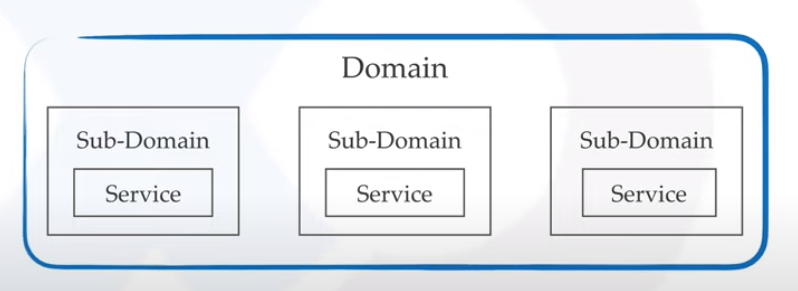

# Microservices

# **What are Microservices?**

**Microservices**, aka **[microservice architecture](https://www.edureka.co/blog/microservice-architecture/)**, is an architectural style that structures an application as a collection of small autonomous services, modeled around a **business domain.** In a Microservice Architecture, each service is self-contained and implements a single business capability. If you want a  detailed understanding of Microservices, you can refer to [my article on Microservices Architecture.](https://www.edureka.co/blog/microservices-tutorial-with-example)

Although microservice solves certain issues, it is not a silver bullet. It has several drawbacks and when using this architecture, numerous issues must be addressed.

### Greenfield

> in other disciplines like software engineering, a greenfield is also a project which lacks any constraints imposed by prior work. The analogy is to that of construction on greenfield land where there is no need to remodel or demolish an existing structure.
> 

(from [http://en.wikipedia.org/wiki/Greenfield_project](http://en.wikipedia.org/wiki/Greenfield_project))

### Brownfield

> Brownfield development is a term commonly used in the IT industry to describe problem spaces needing the development and deployment of new software systems in the immediate presence of existing (legacy) software applications/systems. This implies that any new software architecture must take into account and coexist with live software already in situ.
> 

(from [http://en.wikipedia.org/wiki/Brownfield_(software_development)](http://en.wikipedia.org/wiki/Brownfield_(software_development)))

### Service Portfolio

A service portfolio is a complete listing of all of IT’s products and services. It includes the following three components:

1. **The Service Catalog.** A listing of all the products and services offered under an ITSM strategy.
2. **The Service Pipeline.** The status of proposed services and services that are in development. Pipeline services haven’t gone live yet, and they aren’t available to users or customers. The pipeline also details future growth and when these services may be available.
3. **The Retired Services Catalog.** All services that are being or have been phased out (retired), along with historical information for each service.

### Downstream

> In a telecommunications network or computer network, downstream refers to data sent from a network service provider to a customer.
> 

(from [https://en.wikipedia.org/wiki/Downstream_(networking)](https://en.wikipedia.org/wiki/Downstream_(networking)))

### Proxy Service

> A service proxy is a network component that acts as an intermediary for requests seeking resources from microservices application components. A client connects to the service proxy to request a particular service (file, connection, web page, or other resources) provided by one of the microservices components.
> 

[https://avinetworks.com/glossary/service-proxy/](https://avinetworks.com/glossary/service-proxy/)

### Reverse Proxy

> A reverse proxy server sits between a network and multiple other internal resources. A large website might have dozens of servers that collectively serve requests from a single domain. To accomplish that, client requests would resolve to a machine that would act as a load balancer. The load balancer would then proxy that traffic back to the individual servers.
> 

Some popular open-source reverse proxies are:

- Varnish
- Squid

more on [https://www.varonis.com/blog/what-is-a-proxy-server/](https://www.varonis.com/blog/what-is-a-proxy-server/)

### API Granularity

> In the tech world, granularity refers to the level of detailed information available within your API. Think of it like your bedsheet’s thread count. In a coarse-grained API, your data is typically housed in a few large components, while a fine-grained API spreads it across a large number of smaller components. If your components are equal in size but vary in complexity and features, this could lead to a coarse-grained granularity. To build a fine-grained API, you divide your components based on the cohesiveness and coordination of their functionalities.
> 

[https://horizontal.blog/2020/06/09/fine-grained-vs-coarse-grained-apis/](https://horizontal.blog/2020/06/09/fine-grained-vs-coarse-grained-apis/)

### API Gateway

> An API gateway is an API management tool that sits between a client and a collection of backend services. An API gateway acts as a reverse proxy to accept all application programming interface (API) calls, aggregate the various services required to fulfill them, and return the appropriate result.
> 

[https://www.redhat.com/en/topics/api/what-does-an-api-gateway-do#:~:text=An API gateway is an,and return the appropriate result](https://www.redhat.com/en/topics/api/what-does-an-api-gateway-do#:~:text=An%20API%20gateway%20is%20an,and%20return%20the%20appropriate%20result).

[API Gateway](API%20Gatewa%20005bc.md)

## DDD (Domain Driven Design) in Microservices

Domain-driven design is a way of looking at software from top to down. When we are developing software our focus shouldn't be primarily on technology, it should be on business or whatever activity that we are trying to assist with the software, the domain.

The domain is the business that we trying to solve with software. We have lots of services and each one of them is going to solve a part of that domain.

> Read more about [Domain Driven Design](Domain-Driven-Design.md)

# Principles

The principles that microservice has been built on.

1. Scalability
2. Availability
3. Resiliency
4. Independent, autonomous
5. Real-Time Load Balancing
6. Decentralized governance
7. Seamless API Integration and Continuous Monitoring
8. Failure isolation
9. Auto-Provisioning
10. Continuous delivery through DevOps Integration

## Resiliency

A microservice needs to be resilient to failures and to be able to restart often on another machine for availability. This resiliency also comes down to the state that was saved on behalf of the microservice, where the microservice can recover this state from, and whether the microservice can restart successfully.

## Fault Isolation

Microservices also offer improved fault isolation whereby in the case of an error in one service the whole application doesn't necessarily stop functioning. When the error is fixed, it can be deployed only for the respective service instead of redeploying an entire application.

# Design Patterns

## Decomposition Patterns

Microservices are developed with an idea on developers mind to create small services, with each having their own functionality. But, breaking an application into small autonomous units has to be done logically. So, to decompose a small or big application into small services, you can use the Decomposition patterns.

With the help of this pattern, either you can decompose an application based on business capability or on based on the sub-domains. For example, if you consider an e-commerce application, then you can have separate services for orders, payment, customers, products if you decompose by business capability.

But, in the same scenario, if you design the application by decomposing the sub-domains, then you can have services for each and every class. Here, in this example, if you consider the customer as a class, then this class will be used in customer management, customer support, etc. So, to decompose, you can use the Domain-Driven Design through which the whole domain model is broken down into sub-domains. Then, each of these sub-domains will have their own specific model and scope(bounded context).  Now, when a developer designs microservices, he/she will design those services around the scope or bounded context.

Though these patterns may sound feasible to you, they are not feasible for big monolithic applications. This is because of the fact that identifying sub-domains and business capabilities is not an easy task for big applications. So, the only way to decompose big monolithic applications is by following the Vine Pattern or the Strangler Pattern.

### Decompose by business

Microservices is all about making services loosely coupled, applying the single responsibility principle. However, breaking an application into smaller pieces has to be done logically. How do we decompose an application into small services?

One strategy is to decompose by business capability. A business capability is something that a business does to generate value. The set of capabilities for a given business depend on the type of business. For example, the capabilities of an insurance company typically include sales, marketing, underwriting, claims processing, billing, compliance, etc. Each business capability can be thought of as a service, except it’s business-oriented rather than technical.

### Decompose by subdomain

Decomposing an application using business capabilities might be a good start, but you will come across so-called "God Classes" which will not be easy to decompose. These classes will be common among multiple services. For example, the Order class will be used in Order Management, Order Taking, Order Delivery, etc. How do we decompose them?

For the "God Classes" issue, DDD (Domain-Driven Design) comes to the rescue. It uses subdomains and bounded context concepts to solve this problem. DDD breaks the whole domain model created for the enterprise into subdomains. Each subdomain will have a model, and the scope of that model will be called the bounded context. Each microservice will be developed around the bounded context.

<aside>
💡 **Note**: Identifying subdomains is not an easy task. It requires an understanding of the business. Like business capabilities, subdomains are identified by analyzing the business and its organizational structure and identifying the different areas of expertise.

</aside>

### Strangler Pattern

So far, the design patterns we talked about were decomposing applications for greenfield, but 80% of the work we do is with brownfield applications, which are big, monolithic applications. Applying all the above design patterns to them will be difficult because breaking them into smaller pieces at the same time it's being used live is a big task.

The Strangler pattern comes to the rescue. The Strangler pattern is based on an analogy to a vine that strangles a tree that it’s wrapped around. This solution works well with web applications, where a call goes back and forth, and for each URI call, a service can be broken into different domains and hosted as separate services. The idea is to do it one domain at a time. This creates two separate applications that live side by side in the same URI space. Eventually, the newly refactored application “strangles” or replaces the original application until finally, you can shut off the monolithic application.

According to the strangler pattern, two separate applications will live side by side in the same URI space, and one domain will be taken in to account at an instance of time. So, eventually, the new refactored application wraps around or strangles or replaces the original application until you can shut down the monolithic application

## Integration Patterns

### API Gateway Pattern

When an application is broken down into smaller microservices, there are a few concerns that need to be addressed:

1. How to call multiple microservices abstracting producer information.
2. On different channels (like desktop, mobile, and tablets), apps need different data to respond to the same backend service, as the UI might be different.
3. Different consumers might need a different format of the responses from reusable microservices. Who will do the data transformation or field manipulation?
4. How to handle different types of Protocols some of which might not be supported by producer microservice.

Well, the solution to these kinds of problems could be the API Gateway Design Pattern.  The API Gateway Design Pattern address not only the concerns mentioned above but it solves many other problems. This microservice design pattern can also be considered as the proxy service to route a request to the concerned microservice. Being a variation of the Aggregator service, it can send the request to multiple services and similarly aggregate the results back to the composite or the consumer service. API Gateway also acts as the entry point for all the microservices and creates fine-grained APIs’ for different types of clients.

With the help of the API Gateway design pattern, the API gateways can convert the protocol request from one type to other. Similarly, it can also offload the authentication/authorization responsibility of the microservice.

So, once the client sends a request, these requests are passed to the API Gateway which acts as an entry point to forward the clients’ requests to the appropriate microservices. Then, with the help of the load balancer, the load of the request is handled and the request is sent to the respective services. Microservices use Service Discovery, which acts as a guide to find the communication route between them. Microservices then communicate with each other via a stateless server i.e. either by HTTP Request/Message Bus.

An API Gateway helps to address any concerns raised by microservice implementation, not limited to the ones above.

1. An API Gateway is the single point of entry for any microservice calls.
2. It can work as a proxy service to route a request to the concerned microservice, abstracting the producer details.
3. It can fan out a request to multiple services and aggregate the results to send back to the consumer.
4. One-size-fits-all APIs cannot solve all the consumer's requirements; this solution can create a fine-grained API for each specific type of client.
5. It can also convert the protocol request (e.g. AMQP) to another protocol (e.g. HTTP) and vice versa so that the producer and consumer can handle it.
6. It can also offload the authentication/authorization responsibility of the microservice.

### Aggregator Pattern

We have talked about resolving the aggregating data problem in the API Gateway Pattern. However, we will talk about it here holistically. When breaking the business functionality into several smaller logical pieces of code, it becomes necessary to think about how to collaborate the data returned by each service. This responsibility cannot be left with the consumer, as then it might need to understand the internal implementation of the producer application.

Aggregator in the computing world refers to a website or program that collects related items of data and displays them. So, even in Microservices patterns, Aggregator is a basic web page that invokes various services to get the required information or achieve the required functionality.

The Aggregator pattern helps to address this. It talks about how we can aggregate the data from different services and then send the final response to the consumer. This can be done in two ways:

1. A **composite microservice** will make calls to all the required microservices, consolidate the data, and transform the data before sending it back.

2. An **API Gateway** can also partition the request to multiple microservices and aggregate the data before sending it to the consumer.

<aside>
💡 It is recommended if any business logic is to be applied, then choose a composite microservice. Otherwise, the API Gateway is the established solution.

</aside>

Also, since the source of output gets divided on breaking the monolithic architecture to microservices, this pattern proves to be beneficial when you need an output by combining data from multiple services. So, if we have two services each having its own database, then an aggregator having a unique transaction ID, would collect the data from each microservice, apply the business logic, and finally publish it as a [REST](https://www.edureka.co/blog/what-is-rest-api/) endpoint. Later on, the data collected can be consumed by the respective services which require that collected data.

The Aggregate Design Pattern is based on the DRY principle. Based on this principle, you can abstract the logic into composite microservices and aggregate that particular business logic into one service.

So, for example, if you consider two services: Service A and B, then you can individually scale these services simultaneously by providing the data to the composite microservice.

### Client-Side UI Composition Pattern

When services are developed by decomposing business capabilities/subdomains, the services responsible for user experience have to pull data from several microservices. There used to be only one call from the UI to a back-end service in the monolithic world to retrieve all data and refresh/submit the UI page. However, now it won't be the same. We need to understand how to do it.

With microservices, the UI has to be designed as a skeleton with multiple sections/regions of the screen/page. Each section will make a call to an individual backend microservice to pull the data. That is called composing UI components specific to the service. Frameworks like AngularJS and ReactJS help to do that easily. These screens are known as Single Page Applications (SPA). This enables the app to refresh a particular region of the screen instead of the whole page.

## Database Patterns

For every application, there is a humongous amount of data present. So, when we break down an application from its monolithic architecture to microservices, it is very important to note that each microservice has a sufficient amount of data to process a request. So, either the system can have a database per each service or it can have a shared database per service.  You can use database per service and shared database per service to solve various problems.  The problems could be as follows:

- Duplication of data and inconsistency
- Different services have different kinds of storage requirements
- Few business transactions can query the data, with multiple services
- De-normalization of data

Well, to solve the first three problems, I think you can go for database per service, as it will be then accessed by the microservice API itself. So, each microservice will have its own database ID,  which thereafter prevents the other services in the system to use that particular database. Apart from this, to solve the issue of de-normalization, you can choose shared databases per service,  to align more than one database for each microservice. This will help you gather data, for the monolithic applications which are broken down into microservices. But, you have to keep in mind that, you have to limit these databases to 2-3 microservices; else, scaling these services will be a problem.

### Database per Service

There is a problem with how to define database architecture for microservices. Following are the concerns to be addressed:

1. Services must be loosely coupled. They can be developed, deployed, and scaled independently.

2. Business transactions may enforce invariants that span multiple services.

3. Some business transactions need to query data that is owned by multiple services.

4. Databases must sometimes be replicated and sharded to scale.

5. Different services have different data storage requirements.

To solve the above concerns, one database per microservice must be designed; it must be private to that service only. It should be accessed by the microservice API only. It cannot be accessed by other services directly. For example, for relational databases, we can use private-tables-per-service, schema-per-service, or database-server-per-service. Each microservice should have a separate database id so that separate access can be given to put up a barrier and prevent it from using other service tables.

### Shared database per service

We have talked about one database per service being ideal for microservices, but that is possible when the application is greenfield and to be developed with DDD. But if the application is a monolith and trying to break into microservices, denormalization is not that easy. What is the suitable architecture in that case?

A shared database per service is not ideal, but that is the working solution for the above scenario. Most people consider this an anti-pattern for microservices, but for brownfield applications, this is a good start to break the application into smaller logical pieces. This should not be applied to greenfield applications. In this pattern, one database can be aligned with more than one microservice, but it has to be restricted to 2-3 maximum, otherwise scaling, autonomy, and independence will be challenging to execute.

### Command Query Responsibility Segregation (CQRS)

Once we implement database-per-service, there is a requirement to query, which requires joint data from multiple services — it's not possible. Then, how do we implement queries in microservice architecture?

CQRS suggests splitting the application into two parts — the command side and the query side. The command side handles the Create, Update, and Delete requests. The query side handles the query part by using the materialized views. The **event sourcing pattern** is generally used along with it to create events for any data change. Materialized views are kept updated by subscribing to the stream of events.

<aside>
💡 A materialized view is a pre-computed data set derived from a query specification (the SELECT in the view definition) and stored for later use. Because the data is pre-computed, querying a materialized view is faster than executing a query against the view's base table.

</aside>

### Saga Pattern

When each service has its own database and a business transaction spans multiple services, how do we ensure data consistency across services? For example, for an e-commerce application where customers have a credit limit, the application must ensure that a new order will not exceed the customer’s credit limit. Since Orders and Customers are in different databases, the application cannot simply use a local ACID transaction.

A Saga represents a high-level business process that consists of several subrequests, which each update data within a single service. Each request has a compensating request that is executed when the request fails. It can be implemented in two ways:

1. Choreography — When there is no central coordination, each service produces and listens to another service’s events and decides if an action should be taken or not.
2. Orchestration — An orchestrator (object) takes responsibility for a saga’s decision-making and sequencing business logic.

## Observability Patterns

### Log Aggregation

Consider a use case where an application consists of multiple service instances that are running on multiple machines. Requests often span multiple service instances. Each service instance generates a log file in a standardized format. How can we understand the application behavior through logs for a particular request?

We need a centralized logging service that aggregates logs from each service instance. Users can search and analyze the logs. They can configure alerts that are triggered when certain messages appear in the logs. For example, PCF does have a Loggeregator, which collects logs from each component (router, controller, Diego, etc...) of the PCF platform along with applications. AWS Cloud Watch also does the same.

### Performance Metrics

When the service portfolio increases due to microservice architecture, it becomes critical to keep a watch on the transactions so that patterns can be monitored and alerts sent when an issue happens. How should we collect metrics to monitor application performance?

A metrics service is required to gather statistics about individual operations. It should aggregate the metrics of an application service, which provides reporting and alerting. There are two models for aggregating metrics:

- Push — the service pushes metrics to the metrics service e.g. NewRelic, AppDynamics
- Pull — the metrics services pulls metrics from the service e.g. Prometheus

### Distributed Tracing

In a microservice architecture, requests often span multiple services. Each service handles a request by performing one or more operations across multiple services. Then, how do we trace a request end-to-end to troubleshoot the problem?

We need a service which

- Assigns each external request a unique external request-id.
- Passes the external request id to all services.
- Includes the external request-id in all log messages.
- Records information (e.g. start time, end time) about the requests and operations performed when handling an external request in a centralized service.

Spring Cloud Slueth, along with the Zipkin server, is a common implementation.

### Health Check

When microservice architecture has been implemented, there is a chance that a service might be up but not able to handle transactions. In that case, how do you ensure a request doesn't go to those failed instances? With a load balancing pattern implementation.

Each service needs to have an endpoint that can be used to check the health of the application, such as `/health`. This API should o check:

- The status of the host
- The connection to other services/infrastructure
- And any specific logic

Spring Boot Actuator does implement a /health endpoint and the implementation can be customized, as well.

## Cross-Cutting Concern Patterns

### External Configurations

A service typically calls other services and databases as well. For each environment like dev, QA, UAT, prod, the endpoint URL or some configuration properties might be different. A change in any of those properties might require a re-build and re-deploy of the service. How do we avoid code modification for configuration changes?

Externalize all the configuration, including endpoint URLs and credentials. The application should load them either at startup or on the fly.

Spring Cloud config server provides the option to externalize the properties to GitHub and load them as environment properties. These can be accessed by the application on startup or can be refreshed without a server restart.

### Service Discovery Pattern

When microservices come into the picture, we need to address a few issues in terms of calling services:

1. With container technology, IP addresses are dynamically allocated to the service instances. Every time the address changes, a consumer service can break and need manual changes.
2. Each service URL has to be remembered by the consumer and become tightly coupled.

So how does the consumer or router know all the available service instances and locations?

A service registry needs to be created which will keep the metadata of each producer service. A service instance should register to the registry when starting and should de-register when shutting down. The consumer or router should query the registry and find out the location of the service. The registry also needs to do a health check of the producer service to ensure that only working instances of the services are available to be consumed through it. There are two types of service discovery: client-side and server-side. An example of client-side discovery is Netflix Eureka and an example of server-side discovery is AWS ALB.

### Circuit Breaker Pattern

A service generally calls other services to retrieve data, and there is the chance that the downstream service may be down. There are two problems with this: first, the request will keep going to the down service, exhausting network resources, and slowing performance. Second, the user experience will be bad and unpredictable. How do we avoid cascading service failures and handle failures gracefully?

The consumer should invoke a remote service via a proxy that behaves similarly to an electrical circuit breaker. When the number of consecutive failures crosses a threshold, the circuit breaker trips, and for the duration of a timeout period, all attempts to invoke the remote service will fail immediately. After the timeout expires the circuit breaker allows a limited number of test requests to pass through. If those requests succeed, the circuit breaker resumes normal operation. Otherwise, if there is a failure, the timeout period begins again.

With the help of this pattern, the client will invoke a remote service via a proxy. This proxy will basically behave as a circuit barrier. So, when the number of failures crosses the threshold number, the circuit breaker trips for a particular time period. Then, all the attempts to invoke the remote service will fail in this timeout period. Once that time period is finished, the circuit breaker will allow a limited number of tests to pass through and if those requests succeed, the circuit breaker resumes back to the normal operation. Else, if there is a failure, then the time out period begins again.

Netflix Hystrix is a good implementation of the circuit breaker pattern. It also helps you to define a fallback mechanism that can be used when the circuit breaker trips. That provides a better user experience.

### Blue-Green Deployment Pattern

With microservice architecture, one application can have many microservices. If we stop all the services then deploy an enhanced version, the downtime will be huge and can impact the business. Also, the rollback will be a nightmare. How do we avoid or reduce downtime of the services during deployment?

The blue-green deployment strategy can be implemented to reduce or remove downtime. It achieves this by running two identical production environments, Blue and Green. Let's assume Green is the existing live instance and Blue is the new version of the application. At any time, only one of the environments is live, with the live environment serving all production traffic. All cloud platforms provide options for implementing a blue-green deployment. For more details on this topic, check out [this article](https://dzone.com/articles/blue-green-deployment-for-cloud-native-application).

**What Are The Benefits?**

- It helps to reduce the downtime and even reduces it to zero depending on the application design and deployment approach.
- It gives a rapid way of rollback of the application in case of a production issue.
- It helps build confidence in business users as testing the new version can be done in Production in isolation before rollout.

## Chained or Chain of Responsibility Pattern

Chained or Chain of Responsibility Design Patterns produce a single output which is a combination of multiple chained outputs. So, if you have three services lined up in a chain, then, the request from the client is first received by Service A. Then, this service communicates with the next Service B and collects data. Finally, the second service communicates with the third service to generate the consolidated output. All these services use synchronous HTTP requests or responses for messaging. Also, until the request passes through all the services and the respective responses are generated, the client doesn’t get any output. So, it is always recommended not to make a long chain, as the client will wait until the chain is completed

One more important aspect which you need to understand is that the request from Service A to Service B may look different from Service B to Service C. Similarly the response from Service C to Service B may look completely different from Service B to Service A.

## **Event Sourcing Design Pattern**

The event sourcing design pattern creates events regarding the changes in the application state. Also, these events are stored as a sequence of events to help the developers track which change was made when. So, with the help of this, you can always adjust the application state to cope up with the past changes. You can also query these events, for any data change and simultaneously publish these events from the event store. Once the events are published, you can see the changes in the application state on the presentation layer.

## **Branch Pattern**

The branch microservice design pattern is a design pattern in which you can simultaneously process the requests and responses from two or more independent microservices. So, unlike the chained design pattern, the request is not passed in a sequence, but the request is passed to two or more mutually exclusive microservices chains. This design pattern extends the Aggregator design pattern and provides the flexibility to produce responses from multiple chains or single chains. For example, if you consider an e-commerce applicatibon, then you may need to retrieve data from multiple sources and this data could be a collaborated output of data from various services. So, you can use the branching pattern, to retrieve data from multiple sources.

There are many other patterns used with microservice architecture, like Sidecar, Continuous Delivery Patterns, and more.

## Sidecar Container

Deploy components of an application into a separate process or container to provide isolation and encapsulation. This pattern can also enable applications to be composed of heterogeneous components and technologies.

This pattern is named *Sidecar* because it resembles a sidecar attached to a motorcycle. In the pattern, the sidecar is attached to a parent application and provides supporting features for the application. The sidecar also shares the same lifecycle as the parent application, being created and retired alongside the parent. The sidecar pattern is sometimes referred to as the sidekick pattern and is a decomposition pattern.

[Sidecar Container](Sidecar%20Co%207f6ce.md)

# Build microservice architecture

### iPaaS

> Integration Platform as a Service (iPaaS) is a suite of cloud services enabling development, execution and governance of integration flows connecting any combination of on premises and cloud-based processes, services, applications and data within individual or across multiple organizations.
> 

[https://www.gartner.com/en/information-technology/glossary/information-platform-as-a-service-ipaas](https://www.gartner.com/en/information-technology/glossary/information-platform-as-a-service-ipaas)

## Design microservice

Steps to design a microservice architecture:

1. Understand the monolithic: Study the operation of the monolith and determine the component functions and services it performs.
2. Develop the microservices: Develop each function of the application as an autonomous, independently-running microservice. These usually run in a container on a cloud server. Each microservice answers to a single function – like search, shipping, payment, accounting, payroll, etc.
3. Integrate the larger application: Loosely integrate the microservices via API gateways so they work in concert to form the larger application. An iPaaS can play an essential role in this step.
4. Allocate system usage: Use container orchestration tools like Kubernetes to manage the allocation of system resources for each microservice.

## Switching to microservices

### AWS

**Here’s how Amazon did it:**

- Developers analyzed the source code and pulled out units of code that served a single, functional purpose.
- They wrapped these units in a web service interface.
- For example: They developed a single service for the Buy button on a product page, a single service for the tax calculator function, and so on.

Amazon assigned ownership of each independent service to a team of developers. This allowed teams to view development bottlenecks more granularly and resolve challenges more efficiently since a small number of developers could direct all of their attention to a single service.

As for connecting the microservices to form the larger application:

The solution to the single-purpose function problem was the creation of a rule, to be adhered to by developers, that functions could only communicate with the rest of the world through their own web service APIs. “This enabled us to create a very highly decoupled architecture,” said Brigham, “where these services could iterate independently from each other without any coordination between those services, as long as they adhered to that standard web service interface.” ([source](https://thenewstack.io/led-amazon-microservices-architecture/))

Amazon’s “service-oriented architecture” was largely the beginning of what we now call microservices. It led to Amazon developing a number of solutions to support microservices architectures – such as Amazon AWS (Amazon Web Services) and Apollo – which it currently sells to enterprises throughout the world. Without its transition to microservices, Amazon could not have grown to become the most valuable company in the world – valued by market cap at [$941.19 billion on Feb. 28, 2020](https://ycharts.com/companies/AMZN/market_cap).

[Interview Questions](Interview%20%204b38b.md)

# References

[Microservice Architecture and Design Patterns - DZone Microservices](https://dzone.com/articles/design-patterns-for-microservices)

[Microservices Design Patterns | Microservices Patterns | Edureka](https://www.edureka.co/blog/microservices-design-patterns)

[Service Catalogs vs Service Portfolios: What's The Difference?](https://www.bmc.com/blogs/service-catalog-vs-service-portfolio-whats-the-difference/#)

[4 Examples of Microservices in Action | DreamFactory Blog](https://blog.dreamfactory.com/microservices-examples/)