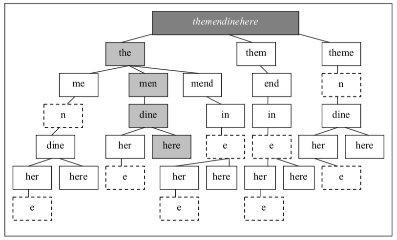

# Homework 01 - Theorical

## 1. NLP Tools & Libraries

### NLTK
Natural Language ToolKit or NLTK is one of the most powerful open-source programming software for creating python programs to deal with natural language processing. This library comes with text processing libraries for classification, tokenization, stemming, tagging, parsing, and semantic reasoning, wrappers for industrial-strength NLP libraries, and an active community.

For example, you can tokenize a sentence using

```python
>>> import nltk
>>> sentence = """At eight o'clock on Thursday morning
... Arthur didn't feel very good."""
>>> tokens = nltk.word_tokenize(sentence)
>>> tokens
['At', 'eight', "o'clock", 'on', 'Thursday', 'morning',
'Arthur', 'did', "n't", 'feel', 'very', 'good', '.']
>>> tagged = nltk.pos_tag(tokens)
>>> tagged[0:6]
[('At', 'IN'), ('eight', 'CD'), ("o'clock", 'JJ'), ('on', 'IN'),
('Thursday', 'NNP'), ('morning', 'NN')]
```

### Gensim
Gensim is a Python library for topic modeling, document indexing, and similarity retrieval with large corpora. It supports distributed computing in some cases.

### Google Cloud Natural Language API

This platform provides us with a few pre-prepared models to estimate content characterization, investigation, and element extraction

### Stanford CoreNLP Library

It's an integrated framework, the Stanford NLP library is a multi-reason apparatus for text investigation fully written in Java. Like NLTK, Stanford CoreNLP gives a wide range of characteristic language preparation programs.

The principal benefit of the Stanford NLP library is its wide versatility and scalability. Keeping aside NLTK, Stanford Core NLP is an ideal solution for handling a lot of information and performing complex tasks.

## 2. Regular Expressions

### Phone number

If you mean, at most, it contains 16 numbers, the RegEx is `(\+989[0-9]{0,13}|09[0-9]{0,14}|00989[0-9]{0,11})`. In the case that you mean it contains at most 16 numbers after `+989`, `00989`, or `09`, it turns out to be much easier `(\+989|09|00989)[0-9]{0,16}`.

- Use `{x,y}` to count the number of characters
- Use `[x-y]` for a range of characters
- Use `\+` to avoid special characters
- Use `|` to union different conditions

### DD-MM-YYYY

`(0[1-9]|[12][0-9]|3[01])-(0[1-9]|1[012])-\d\d\d\d`

- Use `\d` to show a digit (same as `[0-9]`)

### Org & Ir Domains

`(http:\/\/)?(www\.)?([A-Za-z0-9]|\-|\_)*\.(org|ir)`

- Use `?` to make an expression optional
- Use `*` to accept loop through last condition

### Car Plaque

`\d\d[A-Z]\d\d\dIR\d\d`

## 3. Maximum Matching

The problem is that we have a text without any spaces. There are occasional spaces to separate phrases to indicate pauses. Native speakers can separate words effortlessly but teaching a computer to separate them is a different challenge.

There are several algorithms for words segmentation. Maximum Matching is a greedy one that would segment multiple possibilities and choose the one with fewer words in the sentence. For example, consider the `themandinehere`; in this case, we can start from `the`, `them`, and `theme`. Again, We should do the same for the subtrees; at the end, the sentence with fewer words is the answer. (We can prioritize unknown words)



# References
- [https://www.nltk.org/](https://www.nltk.org/)
- [https://radimrehurek.com/gensim/](https://radimrehurek.com/gensim/)
- [https://www.educationworld.in/top-tools-for-natural-language-processing/](https://www.educationworld.in/top-tools-for-natural-language-processing/)
- [NLP: Text Segmentation Using Dictionary Based Algorithms](https://medium.com/@phylypo/nlp-text-segmentation-using-dictionary-based-algorithms-6d0a45a76c08)