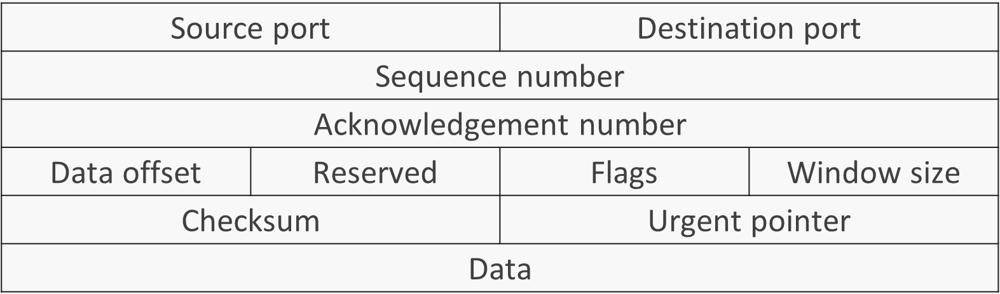
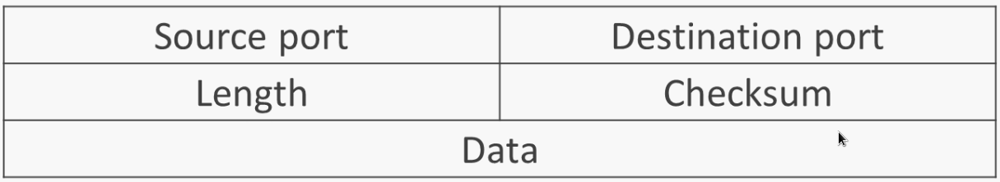

# Network

## Layering in Network

Network has many layers. Each one of them runs one or many protocols.

- **Physical Layer**: This layer defines data transmission in electrical and physical terms.
- **Data Link Layer**: This layer defines the transmission of data between two nodes.
- **Network Layer**: It defines how packets are transmitted between networks. This layer needs to identify the hosts and networks.
- **Transport Layer**: It defines mechanisms to deliver variable length messages.
- **Session Layer**: This layer defines communication between applications running on the host.
- **Presentation Layer**: It defines common formats for data representation.
- **Application Layer**: This layer defines how user-centric applications should send and receive data.

## Connection-oriented Service

### TCP Header format



Flags: 
- `SYN`: Triggers a synchronization of sequence numbers.
- `ACK`: Indicates that receiver should care about the acknowledgment number.
- `FIN`: Starts a process of tearing down a connection.
- `RST`: Resets the connection in case of error.

## Connection-less Service

### UDP Header Format



## RTT or Round Trip Time

Round-trip time (RTT) is the duration, measured in milliseconds, from when a browser sends a request to when it receives a response from a server. It’s a key performance metric for web applications and one of the main factors, along with Time to First Byte (TTFB).

## Network Congestion

The network can handle the transmission of a specific amount of data. If there is more data transmission, it leads to a decrease in performance and an increase in latency. Here are some reasons:

- Heavy Network Traffic
- Network Failure
- Insufficient Bandwidth
- Malware or Cyberattacks

# VPN

## Setup OpenVPN

```bash
# Install the openvpn
sudo apt install openvpn

# Download easy rsa 
wget -P ~/ https://github.com/OpenVPN/easy-rsa/releases/download/v3.0.8/EasyRSA-3.0.8.tgz
tar xvf EasyRSA-3.0.8.tgz
```

In CA:

Change the vars file

```bash
# Make a copy and change the configurations
cp vars.example vars
```

Then

```bash
# Initialize the easy rsa
./easyrsa init-pki

# Build the certificates with no pass
./easyrsa build-ca nopass
```

```bash
# Install the openvpn
sudo apt install openvpn easy-rsa

# Copy easy-rsa directory
sudo make-cadir /etc/openvpn/easy-rsa
```

In the server:

```bash
# Initialize the easy rsa
./easyrsa init-pki

# Generate private key and a certificate
./easyrsa gen-req server nopass

# Copy the certificate file
sudo cp ~/EasyRSA-3.0.8/pki/private/server.key /etc/openvpn/

# Then send your ./pki/reqs/server.req to the CA.
scp ~/EasyRSA-3.0.8/pki/reqs/server.req sammy@your_CA_ip:/tmp
```

In CA:

```bash
# Import it
./easyrsa import-req ./../server.req server

# Sign it in CA
./easyrsa sign-req server server

# Send certificates back to the server
scp pki/issued/server.crt sammy@your_server_ip:/tmp
scp pki/ca.crt sammy@your_server_ip:/tmp
```

Back into the server:

```bash
# Copy certificates to openvpn configs
sudo cp /tmp/{server.crt,ca.crt} /etc/openvpn/

# Generate another kind of keys for more secure connection
./easyrsa gen-dh
openvpn --genkey --secret ta.key
sudo cp ~/EasyRSA-3.0.8/ta.key /etc/openvpn/
sudo cp ~/EasyRSA-3.0.8/pki/dh.pem /etc/openvpn/
```

In the client

```bash
mkdir -p ~/client-configs/keys
chmod -R 700 ~/client-configs

# Generate a key and put it in keys
./easyrsa gen-req client1 nopass
cp pki/private/client1.key ~/client-configs/keys/

# Transfer req to CA
scp pki/reqs/client1.req sammy@your_CA_ip:/tmp
```

On the CA machine

```bash
./easyrsa import-req /tmp/client1.req client1
./easyrsa sign-req client client1

# Send the certificate to the server
scp pki/issued/client1.crt sammy@your_server_ip:/tmp
cp ~/EasyRSA-3.0.8/ta.key ~/client-configs/keys/
sudo cp /etc/openvpn/ca.crt ~/client-configs/keys/
```

## DNS

DNS or Domain name servers change the human-readable path or domain to IP addresses. A DNS resolver can be in ISP or popular DNS providers (Google/Cloudflare). If a DNS resolver can not find the domain name in its cache, It will ask authoritative nameserver. When we update a domain's DNS record, we are updating its authoritative nameserver.

### Root, Domain, and Name servers

But to find the name server we need to ask it from root server. Root server itself forward this request to the domain server. Finally, the domain server forward the request to the authoritative nameserver that is responsible for the domain name.

### DNS Records

- **A record** resolves domain names to IP addresses (IPv4).
- **A record** resolves domain names to IP addresses (IPv6).
- **CNAME record** resolves a domain or subdaomain to another domain name. It is actually an alias.
- **MX record** is used for email.
- **SOA record** stores administrative information about a DNS zone.
- **NS record** provides the name of the authoritative name server whithin domain.
- **SRV record** point to aserver and a service by including a port number.
- **PTR record** resolves the IP addresses to the domain names (Used in email servers). This is known as reverse DNS lookup.
- **TXT record** contains miscellaneous information about a domain.

## TCP / UDP


## SNMP

This protocol is designed for troubleshooting the network. Assume you need to trace to find which components of your network is not working properly. It can be time-consuming in a large network system. 

SNMP protocol which uses UDP/161 and UDP/162 can report the status of network components to the Management Server.

UDP/161 is a polling mechanism to retrieve data from components. The management server ask questions about the status of the components and they also respond to this question.

On the other hand, UDP/162 is called trap SNMP. This mechanism does not rely on management server's questions. Whenever something bad is going to happen, the component will send a message to the management server.

> **Note**: We do not have to choose between Polling and Traps. It is possible to use mixture of them for monitoring the status of the network.

The management server will 

- Record the data for historical use
- Present health information as graphs
- Provide a web base dashboard
- Send alerts

# See More

- [VPN](Network/VPN%2009efe.md)
- [Proxy](Proxy.md)
- [Load Balancing](Load-Balancing.md)
- [CDN](CDN.md)
- [Tor](Network/Tor%20662bd.md)
- [Setup a security camera](Network/SecurityCamera.md)
- [Laboratory](Network/Laboratory%20a293b.md)
- [University](Network/University%20bc284.md)
- [FTP](FTP.md)


