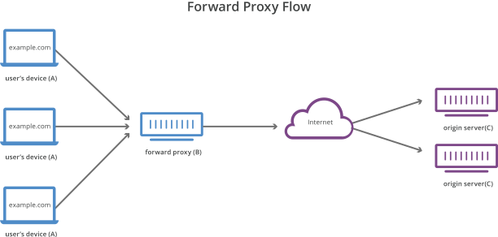

# Forward Proxy

A forward proxy, often called a proxy, proxy server, or web proxy is a server that sits in front of a group of client machines. When those computers make requests to sites and services on the Internet, the proxy server intercepts those requests and then communicates with web servers on behalf of those clients, like a middleman.

## Why use a Forward Proxy?

### Protecting the client's identity

IP addresses of users are hidden from the server. It is complex to trace back the identity of the user because the server is just interacting with forward proxy. Only the IP address of the proxy server will be visible.

### Bypassing browsing restriction

Some governments, schools, and other organizations use firewalls to give their users access to a limited version of the Internet. A forward proxy can be used to get around these restrictions, as they let the user connect to the proxy rather than directly to the sites they are visiting.

### Blockking access to certain content

Conversely, proxies can also be set up to block a group of users from accessing certain sites. For example, a school network might be configured to connect to the web through a proxy which enables content filtering rules, refusing to forward responses from Facebook and other social media sites.

# Reverse Proxy

A reverse proxy is a server that sits in front of one or more web servers, intercepting requests from clients. This is different from a forward proxy, where the proxy sits in front of the clients. With a reverse proxy, when clients send requests to the origin server of a website, those requests are intercepted at the network edge by the reverse proxy server. The reverse proxy server will then send requests to and receive responses from the origin server.

## Why use Reverse Proxy?

### Protecting the website

With a reverse proxy in place, a web site or service never needs to reveal the IP address of their origin server(s). This makes it much harder for attackers to leverage a targeted attack against them, such as a DDoS attack. Instead the attackers will only be able to target the reverse proxy, such as Cloudflare’s [CDN](CDN.md), which will have tighter security and more resources to fend off a cyber attack.

### Load Balancing

A popular website that gets millions of users every day may not be able to handle all of its incoming site traffic with a single origin server. Instead, the site can be distributed among a pool of different servers, all handling requests for the same site. In this case, a reverse proxy can provide a load-balancing solution that will distribute the incoming traffic evenly among the different servers to prevent any single server from becoming overloaded. In the event that a server fails completely, other servers can step up to handle the traffic.

### Global Server Load Balancing

In this form of load balancing, a website can be distributed on several servers around the globe and the reverse proxy will send clients to the server that’s geographically closest to them. This decreases the distances that requests and responses need to travel, minimizing load times.

### Caching

A reverse proxy can also [cache](Caching.md) content, resulting in faster performance. For example, if a user in Paris visits a reverse-proxied website with web servers in Los Angeles, the user might actually connect to a local reverse proxy server in Paris, which will then have to communicate with an origin server in L.A. The proxy server can then cache (or temporarily save) the response data. Subsequent Parisian users who browse the site will then get the locally cached version from the Parisian reverse proxy server, resulting in much faster performance.

### SSL Encryption

Encrypting and decrypting [SSL]() (or [TLS]()) communications for each client can be computationally expensive for an origin server. A reverse proxy can be configured to decrypt all incoming requests and encrypt all outgoing responses, freeing up valuable resources on the origin server.

## Layers of Reverse Proxies

It is common to have multiple layers of reverse proxies. 

- **The first layer** could be an edge service like cloudflare.
- **The second layer** could be an API Gateway or load balancer at hosting provider. Many cloud providers combine these two layers in a single [ingress service]().

# Forward  Proxy VS Reverse Proxy

The difference between a forward and reverse proxy is subtle but important. A simplified way to sum it up would be to say that a forward proxy sits in front of a client and ensures that no origin server ever communicates directly with that specific client. On the other hand, a reverse proxy sits in front of an origin server and ensures that no client ever communicates directly with that origin server.

# Resources

- [Proxy vs Reverse Proxy (Real-world Examples)](https://www.youtube.com/@ByteByteGo)
- [What is a reverse proxy?](https://www.cloudflare.com/learning/cdn/glossary/reverse-proxy/)