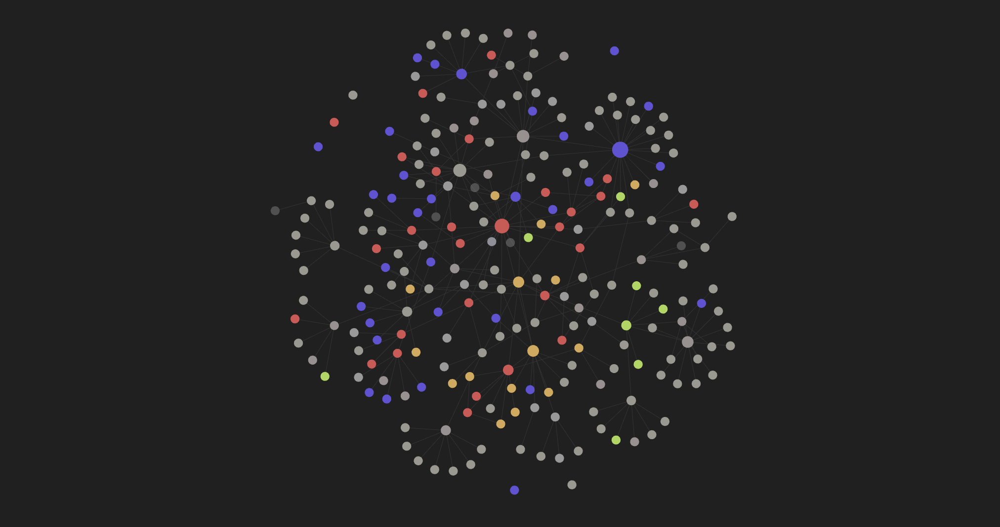
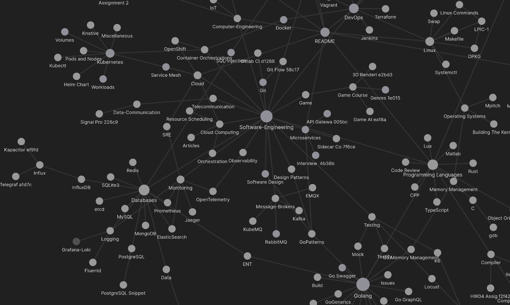

# My Notes

My Notes, or ["My Second Brain"](https://aminmag.ir/blog/my-second-brain/), is a repository in which I keep my notes about things I'm learning. I usually take some notes or document my experiences here.

> ⚠️ You can use Obsidian to open this repository
> 

## Main Entries

Most of the documents are related to computer science.

- [Articles](Articles.md)
- [Books](Books.md)
- [Computer-Science](Computer-Science.md)
	- [Computer-Engineering](Computer-Engineering.md)
	- [Linux](Linux.md)
	- [DevOps](DevOps.md)
	- [Programming Languages](Programming%20Languages.md)
	- [Cloud](Cloud.md)
	- [Microservices](Microservices.md)
	- [Artificial Intelligence](Artificial%20Intelligence.md)
	- [Data Science](Data-Science.md)
	- [Network](Network.md)
- [English](English.md)