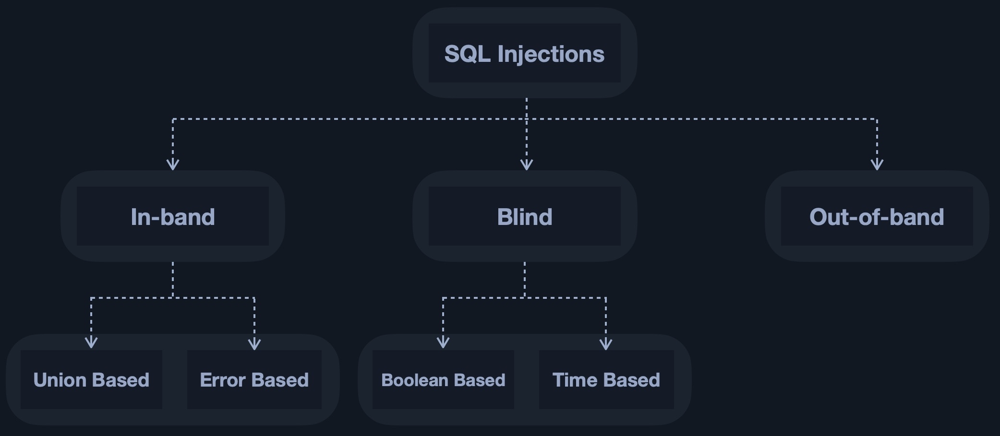

# SQL-Injection
SQL injection or SQLi refers to attacks against relational databases such as `MySQL`. Many types of injection vulnerabilities are possible within web applications, such as HTTP injection, code injection, and command injection.

In the most basic case, this is done by injecting a single quote (`'`) or a double quote (`"`) to escape the limits of user input and inject data directly into the SQL query.

Injection occurs when an application misinterprets user input as actual code rather than a string, changing the code flow and executing it. This can occur by escaping user-input bounds by injecting a special character like (`'`), and then writing code to be executed, like JavaScript code or SQL in SQL Injections.

## Types of SQLi



### In-band

In simple cases, the output of both the intended and the new query may be printed directly on the front end, and we can directly read it. This is known as `In-band` SQL injection.

- Union Based SQLi: we may have to specify the exact location, 'i.e., column', which we can read, so the query will direct the output to be printed there.
- Error Based SQLi:  it is used when we can get the `PHP` or `SQL` errors in the front-end, and so we may intentionally cause an SQL error that returns the output of our query.

#### Union Based Attacks

- Special characters to find the vulnerability: `'`, `"`, `#`, `;`, `)`.
- For bypassing the authentication we can inject an `OR` statement.

Basic tricks
- Add `OR` statement
- Add `--`, `#`, or `/**/` to comment rest of the query
- Use `union` statement

#####  Detect number of columns

Before going ahead and exploiting Union-based queries, we need to find the number of columns selected by the server. There are two methods of detecting the number of columns:

###### Order By

The first way of detecting the number of columns is through the `ORDER BY` function, which we discussed earlier. We have to inject a query that sorts the results by a column we specified, 'i.e., column 1, column 2, and so on', until we get an error saying the column specified does not exist.

```sql
' order by 2-- -
```

###### UNION

The other method is to attempt a Union injection with a different number of columns until we successfully get the results back. The first method always returns the results until we hit an error, while this method always gives an error until we get a success.

```sql
cn' UNION select 1,2,3,4-- -
```

### Blind

In more complicated cases, we may not get the output printed, so we may utilize SQL logic to retrieve the output character by character.

- Boolean Based SQLi: we can use SQL conditional statements to control whether the page returns any output at all,
- Time Based SQLi: we use SQL conditional statements that delay the page response if the conditional statement returns `true` using the `Sleep()` function.


### Out-of-band

Finally, in some cases, we may not have direct access to the output whatsoever, so we may have to direct the output to a remote location, 'i.e., DNS record,' and then attempt to retrieve it from there.

## Impact
A SQL injection can have a tremendous impact, especially if privileges on the back-end server and database are very lax.

- We may retrieve secret/sensitive information that should not be visible to us
- We may subvert the intended web application logic.

## Prevention

SQL injections are usually caused by poorly coded web applications or poorly secured back-end server and databases privileges.


# Resources
- [Hack the box academy](https://academy.hackthebox.com/)