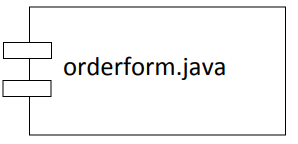
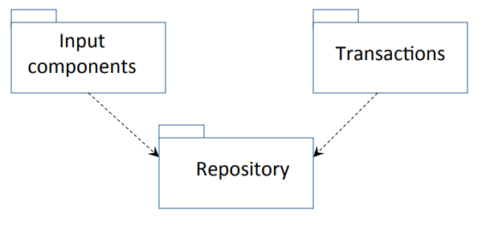
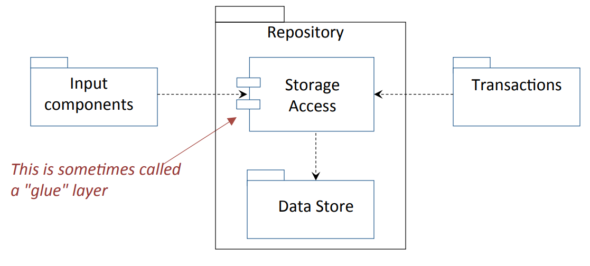
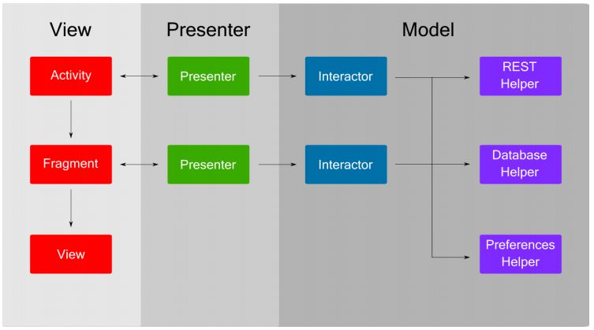
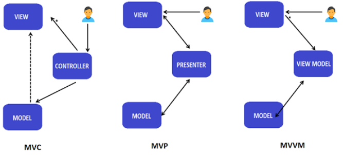
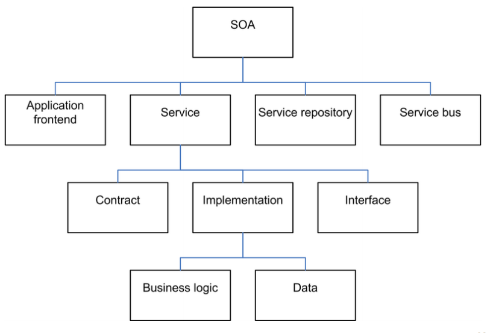
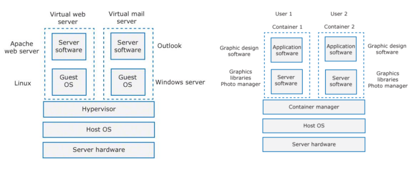
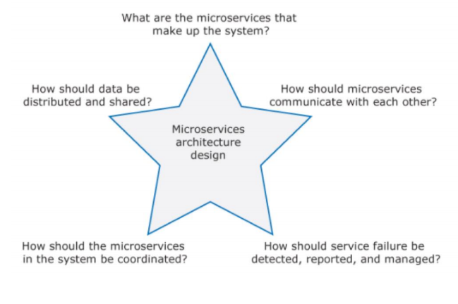

# Design

We have system design and program design. In system design, we define our components and their relations to each other. In program design, We discuss the design patterns that can be used in writing codes. (function, classes, and...)

Designing needs knowledge and creativity. 

The key to good design is simplicity and simplicity itself comes from creativity. We should seek simplicity in our design because the best designs are easy to understand, implement, test, and maintain.

The environment can affect our design. For example, using a framework might enforce the developer to implement specific design and architecture. Other examples are databases or testing frameworks. 

<aside>
💡 So it is kind of important to consider the testing framework that we are going to use. Because it may affect our design.

</aside>

Most of our decisions at the design and architectural level are emanated from these 2 principles.

1. Coupling (to decrease coupling)
    
    The components should have less relation and connectivity with each other as much as possible. The components are actually our features so they are kind of separate.  
    
2. Cohesion (to increase cohesion)
    
    The classes in a component should be highly connected and related to each other.
    

<aside>
💡 It is important to check these principles when you're designing.

</aside>

One way of representing our design is UML and there are many other ideas about this representation. Actually, It depends on the situation, and maybe using another representation for our design is better than the UML form.

# Component

A component is a replaceable part of a system that conforms to and provides the realization of a 
set of interfaces. It actually a subsystem. It is a distributable piece of implementation of a system.

We are able to make a UML definition of a component.

Each component has 2 ports that represent the import and export APIs. The import port represents every API that passes in data to this component, And the export port actually represents all of the APIs that have been exposed from that component and we can use them.

<aside>
💡 Note: Each component talks to the outside world just by its interfaces.

</aside>

A set of components can be in a package. Also, Each one of the components may live on nodes.

# Architectural Styles

## Monolithic

Like kernel.

<aside>
💡 Note: In microservices anything that is not microservice is monolithic and it is different from this concept of being monolithic.

</aside>

## Pipe

- It is used in the compiler.
- Low-Coupling
    
    <aside>
    💡 Note: Because of this it can have many variations like compilers.
    
    </aside>
    
- End-To-End testing is easy.
- It is not good for a parallel scenario.
- Error propagation issue.

## Client-Server (Centralized)

Benefits:

- Low-Coupling
- Easy testing
- Security
    - Talking about insider attacks. (Chain Attack)
- Simple

Disadvantages

- Scale-out
- Single point of failure
- Cost

<aside>
💡 Note: Each one of the servers or clients can have its own design and architecture.

</aside>

### Security

It is the CIA.

- C for Confidentiality: Can not read our messages.
- I for Integrity: Can not change our files.
- A for Availability: Being available.

### Encryption

The best encryptions are AES and after that DES. Social media are using DES because the security on the other hand is to break the encryption to control the activities.

### Handle lots of requests

Buffering and make a queue could be a solution but it doesn't work usually. 

Other ways are:

- Scale-up is to improve the hardware.
- Scale-out is to add new servers.

## P2P (Distributed)

Each node could be a client or server.

Benefits:

- They are distributed so that is is no single point of failure.

Disadvantages

- Black holes

### Ad Hoc

### MOM

### RTA

## SEMI-P2P

We add some servers to resolve some issues in P2P. But cause a single point of failure in a way.

## Repository (Blackboard)

Git or DBMS use this architecture style. The actions on the repository are atomic. Other examples could be Wikipedia that is a knowledge base site and people can read and write.

Disadvantages:

- Single point of failure
- It is a little complex.
- The repository has high-Coupling (Solutions would be using an Interface above the Repository component, DAO, or Separating write & read)

Benefits:

- Flexible for Data-Intensive systems.

### Repository with the storage access layer

The data store subsystem can be changed without modifying any component except the Storage access.

## MVC (Model-View-Controller)

- The controller contains logical things.
- The model contains data and entities.
- View

Here we can have one-to-n relation between these layers.

MVC vs 3-layer-architecture

- Unlike a 3-layer architecture, the first layer that receives the request is the controller. After that, the controller will return the view.
- MVC has two kinds of variations, passive or active. When it is passive model should be updated by the controller, but on the other hand, it can update itself without controller involvement.
- MVC has less coupling.
- Performance and scaling is easier in MVC. (because of the relations between layers)

This is the famous MVC one. Coupling is important to us so if we want to keep it without dependency, we should use a kind of notifier like an observer. (dash line)

## MVP (Model-View-Presenter)

It is a variation of MVC. There is no relation between view and model.

In MVP each view only interacts with one presenter. Actually here is a one-to-one relation.

In android applications

## MVVM

In MVVM the relation between view and view model is on directional unlike the MVP.

## MVT (Django)

# Time-Critical Systems

They're systems that their functionalities depend on their result and the time they have been produced.

Types of Time-Critical Systems

- Hard:
    - Autopilot
    - Atomic systems
- Soft
    - Games

<aside>
💡 Note: Real-time means that you have a limitation on your response time.

</aside>

## Daemon

There is a daemon that dispatches the incoming request to processes, or it can create a new process to respond to that request.

## Distributed Data Systems

The systems that work with plenty of data.

- Mirror (Same system just like each other)
    - It decreases the database overhead.
    - Make it more reliable.
    - Better performance because of less response time. (Geographical example about google)
    
    <aside>
    💡 Note: Mirrors just look act like systems but can not change or update things.
    
    </aside>
    
- Cache (Save the responses for the most incoming requests)
    - Better performance because of less response time.

### CAP Theory

It says you can not have these three together.

- Consistency
- Availability
- Partition

## Buffering

## Three Tier Architecture

Tier is physical but the layer is logical.

Advantages

- Simple
- Testing Upper and lower layer

Disadvantages

- More coupling
- Performance
- Testing middle layer

We have two kinds of variation, open and close layer architecture.

## Event-Driven

The main difference between message and event is that event make a change in the system although a message necessarily doesn't.

 There are two entities in these kinds of architecture.

- Emitters or sources
- Consumers

### Event Mediator

ATC Example

It makes less coupling. There is no relations kind of airplanes.

## Frontend-Backend

What is the difference between this architecture and client-server?

Client-Server is essentially in separate nodes but we can have both frontend and backend in one node. (So actually the difference is physical)

## Distributed Computing

### Shared Nothing

Map reduced

## Service-Oriented Architecture (SOA)

The difference between functions and services are

- Services is an independent quiddity.
- Services have business value.
- We communicate to services by remote calling.

There become lots of middleware because of various implementations of service-oriented software. This kind of lots of middleware was annoying so people try to standardize it.

DOD come up with a Standard Service that

- Interact with internet
    - Web
    - Http

It was the bearing of Web APIs and Web Services that we can use. The communication is based on JSON and we don't care about the technologies that the provider used to do the job.  We can communicate with that service since we know about the IDL. (Interface Definition Language)

<aside>
💡 QoS is the quality of services

</aside>

- SAAS: Software as a service. Dropbox, Online Office.
- FAAS: Function as a service
- PAAS: Platform as a service. Azure.
- CAAS: Container as a service GPU
- IASS: Infrastructure as a service. Amazon, Google Cloud.

Rendering is an embarrassingly parallel app.

GPU should be a container we can not use virtualization. 

To have Service-oriented architecture, Here are the basic laws.

- Service Designs
    - Reusable (Payment Service)
    - Granularity
    - Modularity
    - Interoperability (Being backward compatible)
    - Composable
- Standards
- Service identification and categorization like monitoring

## Space-Bound Architecture

Small computing but we need lots of cores.

# Cloud-Native Applications

There are applications that from the ground up they are designed to deploy in the cloud.

### Containerized

The container is an isolated space with no shared resources.

VM vs Container

- VM is heavyweight because all of the requests should be interpreted by Hypervisor and mapped to Host OS instructions. On the other hand, containers are isolated spaces in the kernel so it is super fast.
- There is no Translation.

<aside>
💡 HA Zones or High Available Zones are better to have completely different kinds of configurations.

</aside>

About COTS (Common Off The Shelf)

Advantages

Disadvantages

- Can not handle a big request.
- Maintenance

Docker (as container manager)

- Docker registries like Docker hub contain the images the files.
- Docker daemon is actually the container manager and knows about when to run when to pause, and ...
- Images could be our states
- Containers are the space to run the images

### Dynamic Orchestration

- The system must start the correct container at the right time.
- Be able to scale by adding or removing based on demand.
- Launch containers on different machines in the event of failure.

Tools are Kubernetes, Docker Swarm

### Microservice oriented

- Small
- Autonomous: It means they are acting on their own.
- Independent: The logic is independent of other services
- Versioned
- Self-Contained: All of the things that we need is provided in the container.

<aside>
💡 Auto-Scaling

</aside>

<aside>
💡 Auto-Convert monolithic to microservice

</aside>

<aside>
💡 CBSE

</aside>

<aside>
💡 SBSE

</aside>

### No Down Time

### Continues delivery

## 12 Factor for Cloud-Native

It is a methodology introduced by Heroku.

1. Code-Base: Each application should have its own Code-Base.
2. Dependencies: Dependencies for the applications should be explicitly declared and isolated. Also no assumption for the execution environment.
3.  Configuration: We should not hardcode our configurations. Examples: Ansible
4. Backing Services: It is any service that the application uses. Examples: SMTP, FTP
5. Build/Release/Run: They should strictly be separated.
6. Processes: The services are stateless.
7. Port Binding:
8. Concurrency
9. Disposability
10. Development/Production Parity
11. Logs
12. Administrative Processes

## Key Design Decision

- Which parts are going to be a microservice?
- Does it have a shared data or distributed one?
- Is it Synchronous or Asynchronous?
- Coordination is orchestration or choreography
- What is the toolset of the backing services

Pros

- Scale
- Cost (Pay As You Go)
- Encapsulated (Transparently)

Cons

- Security
- Lock-in
- Lack of Control
- Reliability

# Distributed Computing

## Cluster

- Clusters are one-purpose intensive, but cloud is general purpose.
- Scaling is limited in clustering. The cluster is smaller than the cloud.
- Manual work in clustering.
- No Pay As You Go in clustering.

## Gvid

## Cloud

- Hyper scalability
- Super transparently
- Resource elasticity
- Dynamic Previsioning
- PAYG

### Fog

The point is to decrease the amount of computation on the final servers by computing on smartphones and IoT devices.

### Edge Computing