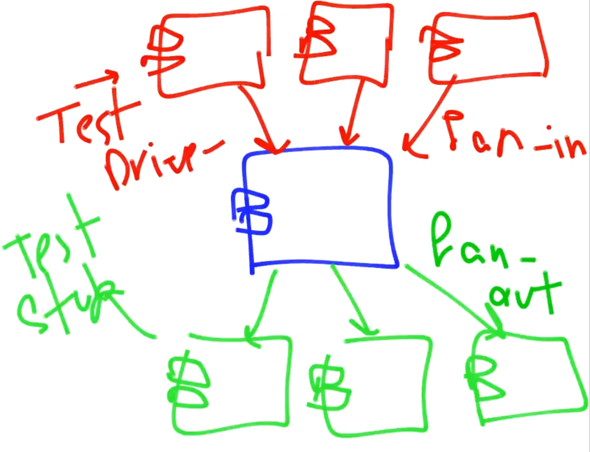

# 🧪 Testing

In this page I want to learn different kinds of testings.

There some approaches for testing software it could be done by the mathematical approach but here we're going to talk about the industrial approach. The definition is "The test is a systematic attempt to find faults in software".

# Testing Phases

Phase 0: There is no difference between debugging and testing
Phase 1: To show that the software is working well.
Phase 2: To show that the software has some issues.

# Other ways to handle

- Static Analysis Techniques
- Declaring the bug to be a feature. They show issues in the code by just parsing the code.
- Patching: It means to "let's sleep on it and fix it later" :)

# Test Terminology

Each one of them could turn out the next step but not essentially.

- Error: It is a mistake that is made by the developer
- Fault: It is a kind of bug
- Failure: It means the software is unable to do its job.

<aside>
💡 We should know about system specification and its duty to decide about an error.

</aside>

# Principles

- Sensitivity: It is better to fail all time than sometimes.
- Fail Faster: It is better to fail faster. It will cost more if it remains until the release stage because it can affect other parts.
- Restriction: To restrict our code.
- Partitioning: Divide And conquer
- Visibility: Ability to measure progress and status.

# Test Goals

- Correctness: To the Functionality of the system be correct. Like unit testing.
- Reliability: Assume t as a range of time that the software should satisfy its goal. It means not to Fail. Load testing.
- Safety: Not to disturb the environment and to fail-safe.
- Performance
- Performability: How easy we can communicate.
- Robustness: This is in an extreme scenario. Stress testing

# Isolation

- Test Stub: There are components that our component is using. We will mock here. They are static and correct values.
- Test Driver: There components that call and use our component.

# Testing Activities

- Unit Testing: To test functions or classes
- Integration Testing: All of the unit testing together.
- Functional Testing
- Performance Testing
- Acceptance Testing: In production
- Installation Test

# Types of testing:

- Black Box, White Box, and Gray Box
- Functional and non-Functional

<aside>
💡 This category depends on the situation may be some kinds of items could be both structured and function.

</aside>

## Black Box, Functional Testing

We don't care about the code (including loops and conditions). We care about the input and output.

### Boundary value testing

Some kinds of bugs are in the loops specifically in the ranges (boundaries) for these loops. In this kind of test, we will choose the special cases that may be failed. 

### Equivalent Class Testing

In this kind of testing, we categorize and partition the class behavior and choose a test case for each one of those partitions. For example, if an arbitrary class has two behavior, one for odd numbers and the other for even numbers, then in this kind of testing we pick an odd and an even number to have a test case for both partitions.

### Decision Table

Based on conditional output.

### Random Testing, Monkeys and Gorillas

Choose Garbage input. If it is a correct input so it becomes a correctness test, otherwise it becomes robust testing.

## White Box, Structure Testing

- Static Testing
- Dynamic Testing
    - Unit Testing
    - Unit Coverage
    - Code complexity

## Unit Coverage

### ❌ Statement Coverage

More lines of code are tested (lines actually represent statements), Then the Better the test is.

### ❌ Path Coverage

To detect the path of the software and test them. But it is not easy to detect all of these paths. It is good but it's not possible.

### ✅ Function Coverage (Unit Testing)

## Gray Box Testing

It is between those two.

# Pesticide Paradox

We use all kinds of testing.

# Mutation Testing

Tests to test quality.

Type of mutations:

- Convert operator
- Convert small pieces of logic
- Convert small portions of data

# Testability

- Controllability
- Isolation
- Separation of concerns
- Understandability
- Automat ability
- Heterogeneity

# Read More

## Unit Testing

- [Golang Testify](Golang/Testify.md)
- [TestContainer](TestContainer.md)

## Mocking

- [Golang Mock](Golang/Mock.md)
- [Golang Testify](Golang/Testify.md)

## Load & Performance Testing

- [Performance Testing]()
- [Locust](Locust.md)
- [K6](K6.md)

# References

- [What is Load Testing? How It Works, Tools, Tutorials, and More](https://stackify.com/what-is-load-testing/)
- [Load Testing Tutorial: What is? How to? (with Examples)](https://www.guru99.com/load-testing-tutorial.html#7)

