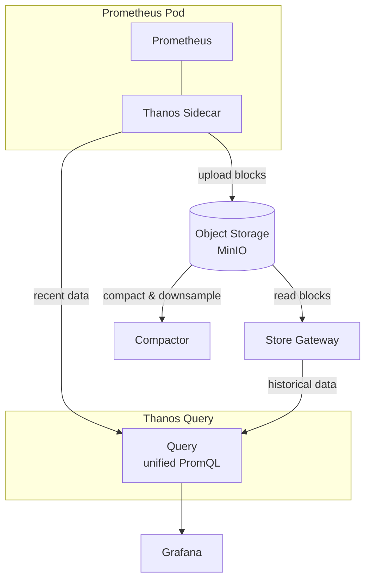

# Adding Thanos to the Monitoring Stack

Thanos adds long-term metrics storage with automatic downsampling to the existing kube-prometheus-stack. It ships metrics from Prometheus to object storage (MinIO) and compacts them into lower-resolution buckets over time.

## Architecture



### Components

- **Sidecar**: runs as a container alongside Prometheus, uploads TSDB blocks to object storage and serves real-time data to Query
- **Store Gateway**: reads historical blocks from object storage and serves them to Query
- **Compactor**: downsamples and deduplicates blocks in object storage (runs as a singleton)
- **Query**: provides a unified Prometheus-compatible query API, federating across sidecar (recent data) and store gateway (historical data)
- **Grafana**: points to Thanos Query instead of Prometheus directly

## Downsampling Resolutions (fixed)

| Resolution | Retention | Description |
|---|---|---|
| Raw | 7d | Original scrape interval |
| 5m | 30d | 5-minute aggregates |
| 1h | 365d | 1-hour aggregates |

These three resolution levels are hardcoded in Thanos. You can only change the retention duration, not the resolution intervals.

## Step-by-step Setup

### 1. Create a MinIO bucket

Create a bucket called `thanos` in your MinIO instance at `192.168.100.53:9000`. You can do this via the MinIO console at `minio.ghasvari.com` or with the `mc` CLI:

```bash
mc alias set cave http://192.168.100.53:9000 <ACCESS_KEY> <SECRET_KEY>
mc mb cave/thanos
```

### 2. Create the object store secret

Create a Kubernetes secret with the MinIO connection details. Add this file to `apps/monitoring/`:

```yaml
# apps/monitoring/thanos-objstore-secret.yaml
apiVersion: v1
kind: Secret
metadata:
  name: thanos-objstore-secret
  namespace: monitoring
type: Opaque
stringData:
  objstore.yml: |
    type: S3
    config:
      bucket: thanos
      endpoint: s3-external.databases.svc.cluster.local:80
      access_key: <MINIO_ACCESS_KEY>
      secret_key: <MINIO_SECRET_KEY>
      insecure: true
```

> Uses the in-cluster `s3-external` service (port 9000 via the Service on port 80) so traffic stays internal.

### 3. Enable the Thanos sidecar in values.yaml

In `apps/monitoring/values.yaml`, update the `prometheusSpec.thanos` section (around line 4504):

```yaml
    thanos:
      objectStorageConfig:
        existingSecret:
          name: thanos-objstore-secret
          key: objstore.yml
```

### 4. Deploy Thanos components

The kube-prometheus-stack chart only deploys the **sidecar**. You need a separate Helm release for the compactor, store gateway, and query components using the Bitnami Thanos chart.

```bash
helm repo add bitnami https://charts.bitnami.com/bitnami
helm repo update
```

Create a `thanos-values.yaml`:

```yaml
existingObjstoreSecret: thanos-objstore-secret

query:
  enabled: true
  dnsDiscovery:
    sidecarsService: monitoring-kube-prometheus-thanos-discovery
    sidecarsNamespace: monitoring

compactor:
  enabled: true
  retentionResolutionRaw: 7d
  retentionResolution5m: 30d
  retentionResolution1h: 365d
  persistence:
    enabled: true
    storageClass: longhorn
    size: 10Gi

storegateway:
  enabled: true
  persistence:
    enabled: true
    storageClass: longhorn
    size: 10Gi

# Disable components we don't need
ruler:
  enabled: false
receive:
  enabled: false
bucketweb:
  enabled: false
```

Install:

```bash
helm install thanos bitnami/thanos \
  -n monitoring \
  -f thanos-values.yaml
```

### 5. Point Grafana to Thanos Query

In your kube-prometheus-stack values, update the Grafana datasource to point to Thanos Query instead of Prometheus directly:

```yaml
grafana:
  additionalDataSources:
    - name: Thanos
      type: prometheus
      url: http://thanos-query.monitoring.svc.cluster.local:9090
      isDefault: true
```

### 6. Reduce Prometheus local retention

Since Thanos handles long-term storage, reduce the local Prometheus retention to save disk:

```yaml
  prometheusSpec:
    retention: 7d        # was 30d
    retentionSize: "8GiB" # prevent disk from filling up
```

### 7. Apply

```bash
helm upgrade monitoring prometheus-community/kube-prometheus-stack \
  -n monitoring -f values.yaml
```

## Verify

```bash
# Check sidecar is running (should be a second container in the prometheus pod)
kubectl get pods -n monitoring -l app.kubernetes.io/name=prometheus

# Check Thanos components
kubectl get pods -n monitoring -l app.kubernetes.io/name=thanos

# Check compactor logs for downsampling activity
kubectl logs -n monitoring deploy/thanos-compactor -f

# Query via Thanos
kubectl port-forward -n monitoring svc/thanos-query 9090
# Open http://localhost:9090 and query as usual
```

## Storage Estimate

Rough estimate for a small cluster (~20 active targets, 50k series):

| Resolution | Retention | Estimated size |
|---|---|---|
| Raw | 7d | ~2 GB |
| 5m | 30d | ~1 GB |
| 1h | 365d | ~500 MB |

Actual usage depends on cardinality and scrape interval.
